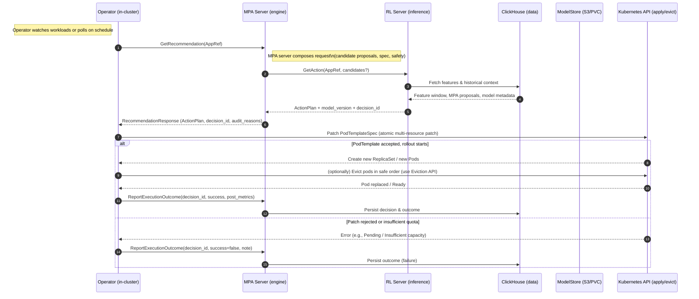

```mermaid
sequenceDiagram
    autonumber
    participant OP as Operator (in-cluster)
    participant MPA as MPA Server (engine)
    participant RL as RL Server (inference)
    participant CH as ClickHouse (data)
    participant MS as ModelStore (S3/PVC)
    participant K8s as Kubernetes API (apply/evict)

    Note left of OP: Operator watches workloads or polls on schedule

    OP->>MPA: GetRecommendation(AppRef)
    Note right of MPA: MPA server composes request\n(candidate proposals, spec, safety)
    MPA->>RL: GetAction(AppRef, candidates?)
    RL->>CH: Fetch features & historical context
    CH-->>RL: Feature window, MPA proposals, model metadata
    RL-->>MPA: ActionPlan + model_version + decision_id
    MPA-->>OP: RecommendationResponse (ActionPlan, decision_id, audit_reasons)
    OP->>K8s: Patch PodTemplateSpec (atomic multi-resource patch)
    alt PodTemplate accepted, rollout starts
      K8s-->>OP: Create new ReplicaSet / new Pods
      OP->>K8s: (optionally) Evict pods in safe order (use Eviction API)
      K8s-->>OP: Pod replaced / Ready
      OP->>MPA: ReportExecutionOutcome(decision_id, success, post_metrics)
      MPA->>CH: Persist decision & outcome
    else Patch rejected or insufficient quota
      K8s-->>OP: Error (e.g., Pending / Insufficient capacity)
      OP->>MPA: ReportExecutionOutcome(decision_id, success=false, note)
      MPA->>CH: Persist outcome (failure)
    end
```
