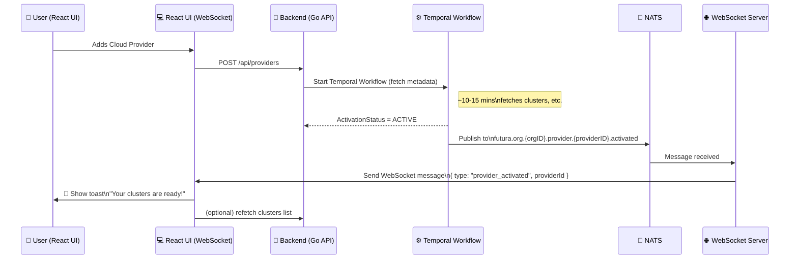

```mermaid
sequenceDiagram
    participant User as 👤 User (React UI)
    participant UI as 💻 React UI (WebSocket)
    participant BE as 🧠 Backend (Go API)
    participant TW as ⚙️ Temporal Workflow
    participant NATS as 📡 NATS
    participant WS as 🌐 WebSocket Server

        User->>UI: Adds Cloud Provider
        UI->>BE: POST /api/providers
        BE->>TW: Start Temporal Workflow (fetch metadata)

        Note right of TW: ~10-15 mins\nfetches clusters, etc.

        TW-->>BE: ActivationStatus = ACTIVE
        TW->>NATS: Publish to\nfutura.org.{orgID}.provider.{providerID}.activated

        NATS->>WS: Message received
        WS->>UI: Send WebSocket message\n{ type: "provider_activated", providerId }

        UI->>User: 🔔 Show toast\n"Your clusters are ready!"
        UI->>BE: (optional) refetch clusters list
```