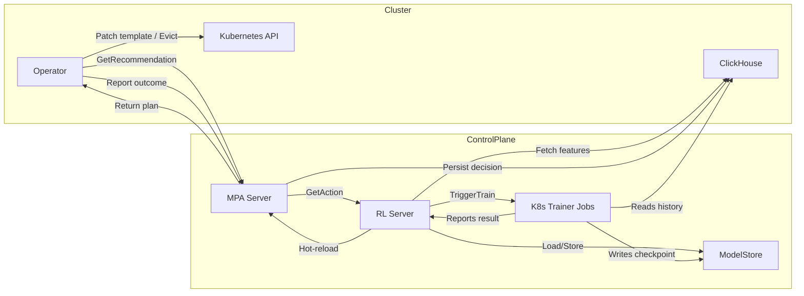

```mermaid
flowchart LR
  subgraph Cluster
    OP[Operator]
    K8s[Kubernetes API]
    CH[ClickHouse]
  end

  subgraph ControlPlane
    MPA[MPA Server]
    RL[RL Server]
    MS[ModelStore]
    JOBS[K8s Trainer Jobs]
  end

  OP -->|GetRecommendation| MPA
  MPA -->|GetAction| RL
  RL -->|Fetch features| CH
  RL -->|Load/Store| MS
  MPA -->|Return plan| OP
  OP -->|Patch template / Evict| K8s
  OP -->|Report outcome| MPA
  MPA -->|Persist decision| CH
  RL -->|TriggerTrain| JOBS
  JOBS -->|Reads history| CH
  JOBS -->|Writes checkpoint| MS
  JOBS -->|Reports result| RL
  RL -->|Hot-reload| MPA
```
