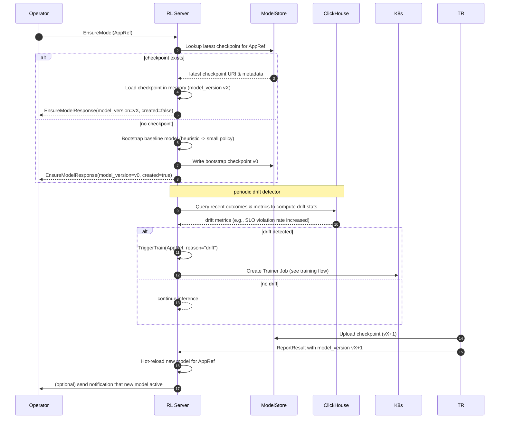

```mermaid
sequenceDiagram
    autonumber
    participant OP as Operator
    participant RL as RL Server
    participant MS as ModelStore
    participant CH as ClickHouse
    participant K8s as K8s

    OP->>RL: EnsureModel(AppRef)
    RL->>MS: Lookup latest checkpoint for AppRef
    alt checkpoint exists
      MS-->>RL: latest checkpoint URI & metadata
      RL->>RL: Load checkpoint in memory (model_version vX)
      RL-->>OP: EnsureModelResponse(model_version=vX, created=false)
    else no checkpoint
      RL->>RL: Bootstrap baseline model (heuristic -> small policy)
      RL->>MS: Write bootstrap checkpoint v0
      RL-->>OP: EnsureModelResponse(model_version=v0, created=true)
    end

    Note over RL,CH: periodic drift detector
    RL->>CH: Query recent outcomes & metrics to compute drift stats
    CH-->>RL: drift metrics (e.g., SLO violation rate increased)
    alt drift detected
      RL->>RL: TriggerTrain(AppRef, reason="drift")
      RL->>K8s: Create Trainer Job (see training flow)
    else no drift
      RL-->>RL: continue inference
    end

    %% After training completes
    TR->>MS: Upload checkpoint (vX+1)
    TR->>RL: ReportResult with model_version vX+1
    RL->>RL: Hot-reload new model for AppRef
    RL->>OP: (optional) send notification that new model active
```
