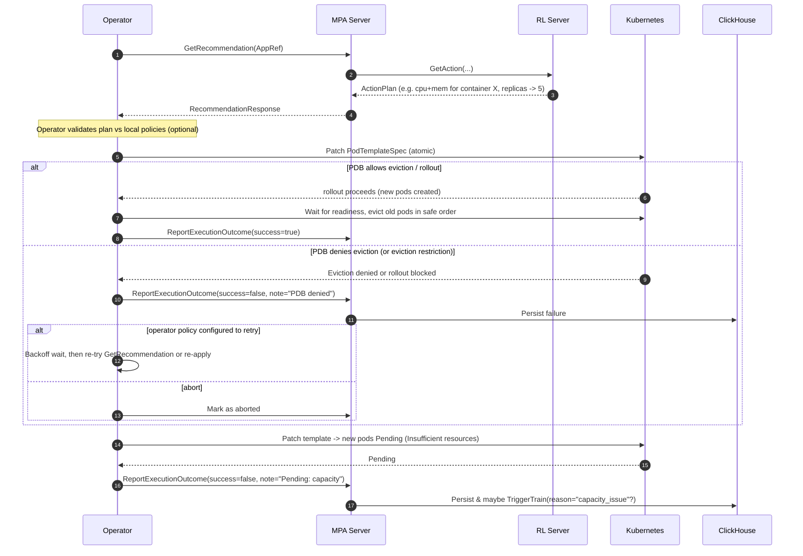

```mermaid
sequenceDiagram
    autonumber
    participant OP as Operator
    participant MPA as MPA Server
    participant RL as RL Server
    participant K8s as Kubernetes
    participant CH as ClickHouse

    OP->>MPA: GetRecommendation(AppRef)
    MPA->>RL: GetAction(...)
    RL-->>MPA: ActionPlan (e.g. cpu+mem for container X, replicas -> 5)
    MPA-->>OP: RecommendationResponse

    Note over OP: Operator validates plan vs local policies (optional)

    OP->>K8s: Patch PodTemplateSpec (atomic)
    alt PDB allows eviction / rollout
      K8s-->>OP: rollout proceeds (new pods created)
      OP->>K8s: Wait for readiness, evict old pods in safe order
      OP->>MPA: ReportExecutionOutcome(success=true)
    else PDB denies eviction (or eviction restriction)
      K8s-->>OP: Eviction denied or rollout blocked
      OP->>MPA: ReportExecutionOutcome(success=false, note="PDB denied")
      MPA->>CH: Persist failure
      alt operator policy configured to retry
        OP->>OP: Backoff wait, then re-try GetRecommendation or re-apply
      else abort
        OP->>MPA: Mark as aborted
      end
    end

    %% Capacity shortage case
    OP->>K8s: Patch template -> new pods Pending (Insufficient resources)
    K8s-->>OP: Pending
    OP->>MPA: ReportExecutionOutcome(success=false, note="Pending: capacity")
    MPA->>CH: Persist & maybe TriggerTrain(reason="capacity_issue"?)
```
