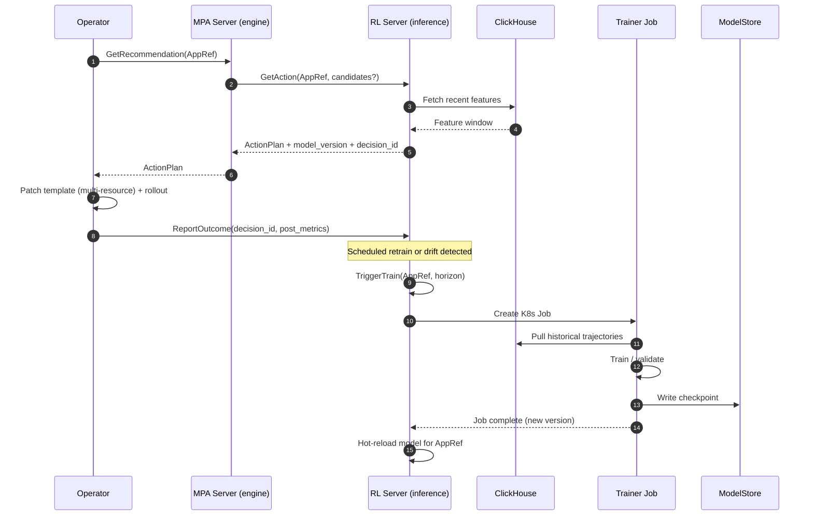

```mermaid
sequenceDiagram
  autonumber
  participant OP as Operator
  participant MPA as MPA Server (engine)
  participant RL as RL Server (inference)
  participant CH as ClickHouse
  participant TR as Trainer Job

  OP->>MPA: GetRecommendation(AppRef)
  MPA->>RL: GetAction(AppRef, candidates?)
  RL->>CH: Fetch recent features
  CH-->>RL: Feature window
  RL-->>MPA: ActionPlan + model_version + decision_id
  MPA-->>OP: ActionPlan
  OP->>OP: Patch template (multi-resource) + rollout
  OP->>RL: ReportOutcome(decision_id, post_metrics)

  Note over RL: Scheduled retrain or drift detected
  RL->>RL: TriggerTrain(AppRef, horizon)
  RL->>TR: Create K8s Job
  TR->>CH: Pull historical trajectories
  TR->>TR: Train / validate
  TR->>ModelStore: Write checkpoint
  TR-->>RL: Job complete (new version)
  RL->>RL: Hot-reload model for AppRef
```
