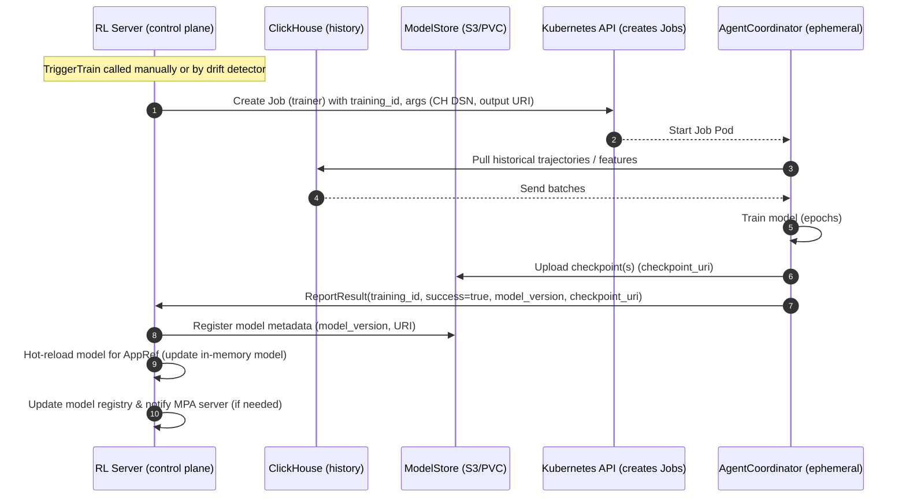

```mermaid
sequenceDiagram
    autonumber
    participant RL as RL Server (control plane)
    participant CH as ClickHouse (history)
    participant MS as ModelStore (S3/PVC)
    participant K8s as Kubernetes API (creates Jobs)
    participant AC as AgentCoordinator (ephemeral)

    Note over RL: TriggerTrain called manually or by drift detector

    RL->>K8s: Create Job (trainer) with training_id, args (CH DSN, output URI)
    K8s-->>AC: Start Job Pod
    AC->>CH: Pull historical trajectories / features
    CH-->>AC: Send batches
    AC->>AC: Train model (epochs)
    AC->>MS: Upload checkpoint(s) (checkpoint_uri)
    AC->>RL: ReportResult(training_id, success=true, model_version, checkpoint_uri)
    RL->>MS: Register model metadata (model_version, URI)
    RL->>RL: Hot-reload model for AppRef (update in-memory model)
    RL->>RL: Update model registry & notify MPA server (if needed)
```
