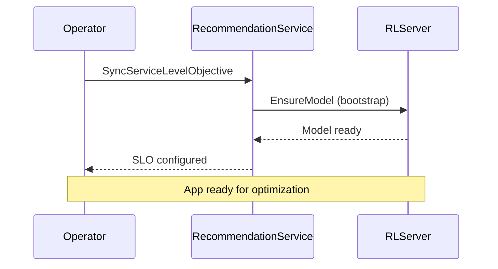
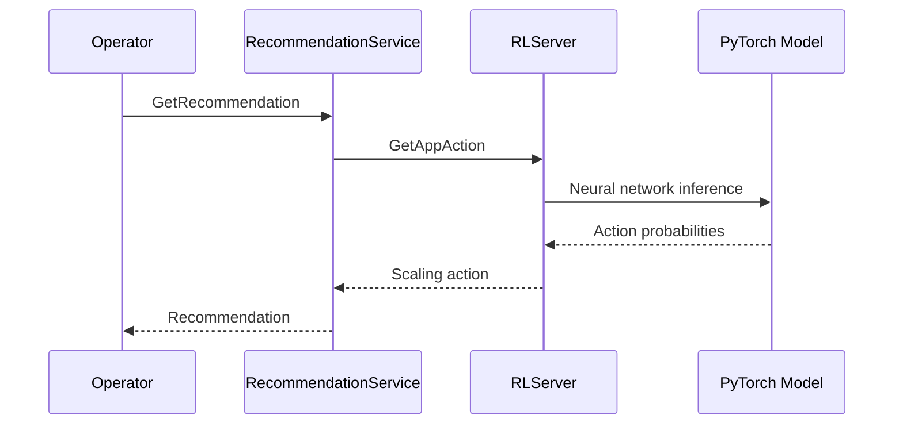
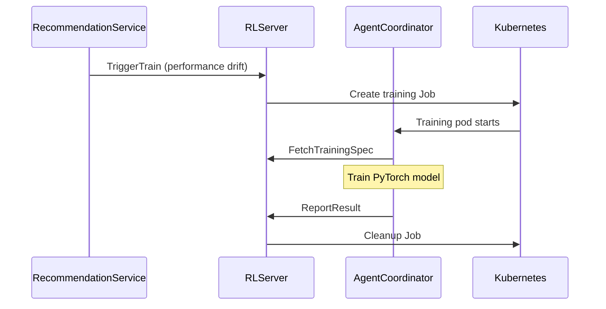

# Futura Engine Documentation

Welcome to the Futura Engine documentation! This guide will help you understand how our ML-powered Kubernetes optimization engine works.

## 📚 Documentation Structure

### Core Services

- **[RecommendationService](./recommendation-service.md)** - Main orchestration and decision-making service
- **[RLServer](./rl-server.md)** - PyTorch model serving and training management
- **[AgentCoordinator](./agent-coordinator.md)** - Training job lifecycle management

### Integration & Architecture

- **[Operator Integration](./operator-integration.md)** - How the Kubernetes operator interacts with the engine
- **[SLO Management](./slo-management.md)** - Service Level Objectives configuration and enforcement
- **[Cluster Configuration](./cluster-configuration.md)** - Cluster optimization settings
- **[Overall Architecture](./architecture.md)** - High-level system architecture and data flows

### ML & Algorithms

- **[PyTorch Models](./pytorch-models.md)** - Deep dive into PPO and Meta-PPO implementations
- **[State Action Space](./state-action-space.md)** - How we model the Kubernetes environment
- **[Reward Functions](./reward-functions.md)** - How we define optimization objectives
- **[Training Pipeline](./training-pipeline.md)** - End-to-end training workflow

### Storage & Infrastructure

- **[ClickHouse Integration](./clickhouse-integration.md)** - Data storage and analytics
- **[Kubernetes Jobs](./kubernetes-jobs.md)** - Training job orchestration
- **[Scaling Algorithms](./scaling-algorithms.md)** - HPA/VPA integration

## 🎯 Quick Start for New Engineers

### 1. Understanding the Big Picture

Start with [Overall Architecture](./architecture.md) to understand how all components work together.

### 2. Core Services Deep Dive

Read the individual service documentation:

1. [RecommendationService](./recommendation-service.md) - The main API entry point
2. [RLServer](./rl-server.md) - The ML brain of the system
3. [AgentCoordinator](./agent-coordinator.md) - Training orchestration

### 3. Operator Integration

Learn how external systems interact with the engine:

- [Operator Integration](./operator-integration.md) - Kubernetes operator communication
- [SLO Management](./slo-management.md) - Performance objectives
- [Cluster Configuration](./cluster-configuration.md) - Optimization settings

### 4. ML Deep Dive

Understand the machine learning components:

- [PyTorch Models](./pytorch-models.md) - Neural network implementations
- [Training Pipeline](./training-pipeline.md) - How models are trained

## 🔄 Common Workflows

### New Application Onboarding



### Getting Recommendations



### Training Pipeline



## 🏗️ System Components

### gRPC Services

- **RecommendationService**: Port 50051 (main API)
- **RLServer**: Port 50051 (can be distributed)
- **AgentCoordinator**: Port 50051 (can be distributed)

### Storage

- **ClickHouse**: Metrics, model metadata, training results
- **S3/PVC**: Model checkpoints and artifacts

### ML Models

- **PPOAgent**: Standard reinforcement learning
- **MetaPPOAgent**: Fast adaptation via meta-learning
- **Scaling Algorithms**: HPA/VPA intelligence

## 🚀 Deployment Patterns

### Single Process (Development)

```bash
uv run main.py --port 50051
```

All services in one process.

### Distributed (Production)

```bash
# Service 1: RL + Coordinator
uv run server.py --services rl+coordinator --port 50051

# Service 2: Recommendation
uv run server.py --services recommendation --port 50052 --rl-server-address localhost:50051
```

## 📊 Monitoring & Observability

### Key Metrics

- **Model Performance**: Confidence scores, action distributions
- **Training Jobs**: Success rate, completion time, model accuracy
- **Recommendations**: Acceptance rate, SLO compliance
- **Resource Usage**: CPU/memory optimization results

### Logs Structure

- **Recommendation decisions** with reasoning and confidence
- **Neural network inference** with action probabilities
- **Training progress** with loss curves and metrics
- **Kubernetes Job lifecycle** events

## 🛠️ Development Guidelines

### Adding New Features

1. Update protobuf definitions in `proto/engine/`
2. Implement service methods
3. Add documentation with Mermaid diagrams
4. Update integration tests

### ML Model Changes

1. Modify models in `rl_models/`
2. Update training scripts
3. Test with Kubernetes Jobs
4. Document model architecture changes

### Operator Integration Changes

1. Update service interfaces
2. Test with actual operator
3. Document new CRD interactions
4. Update deployment manifests

Ready to dive deeper? Start with [Overall Architecture](./architecture.md)!
