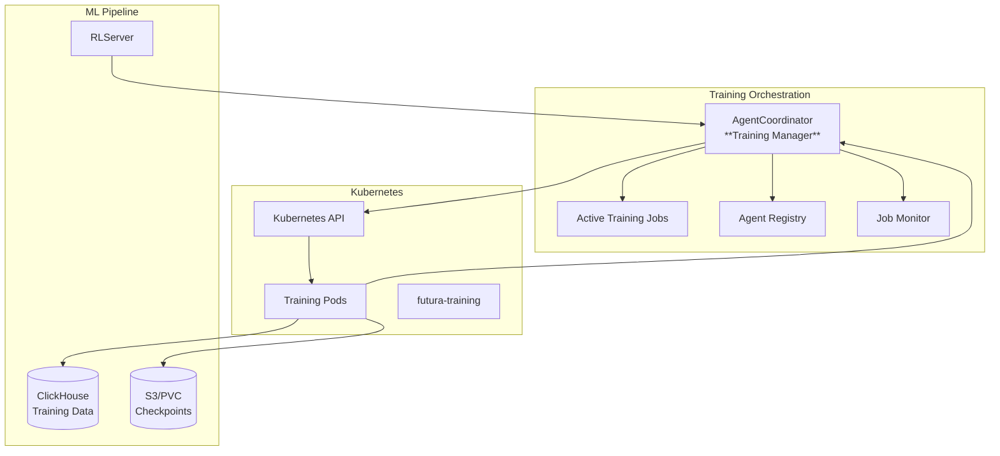
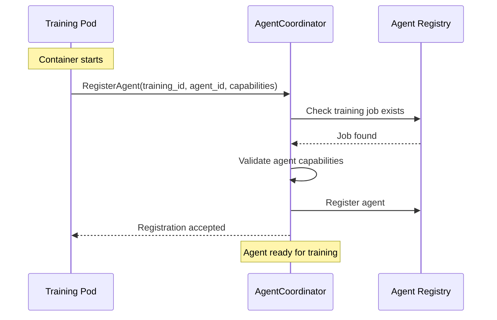
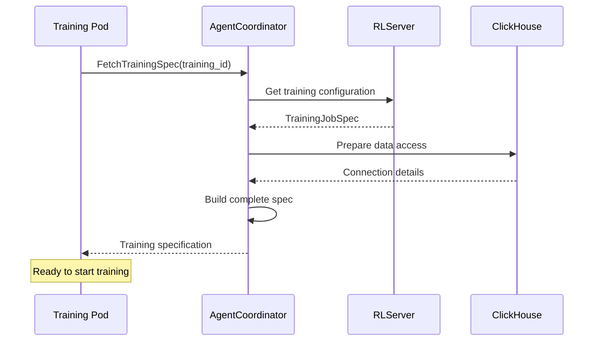
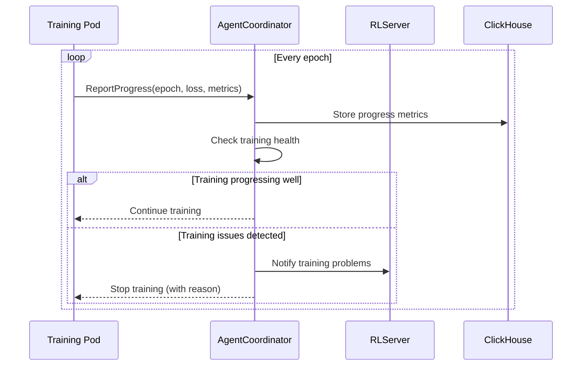
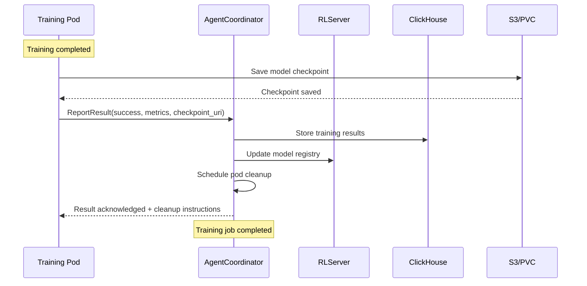
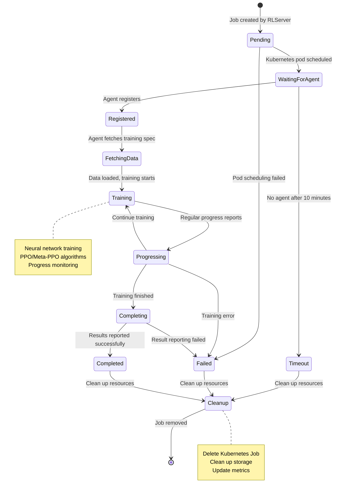
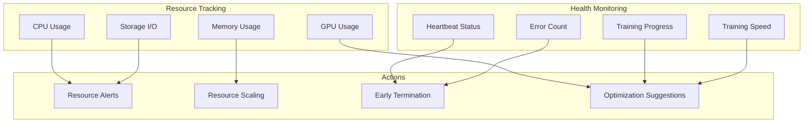
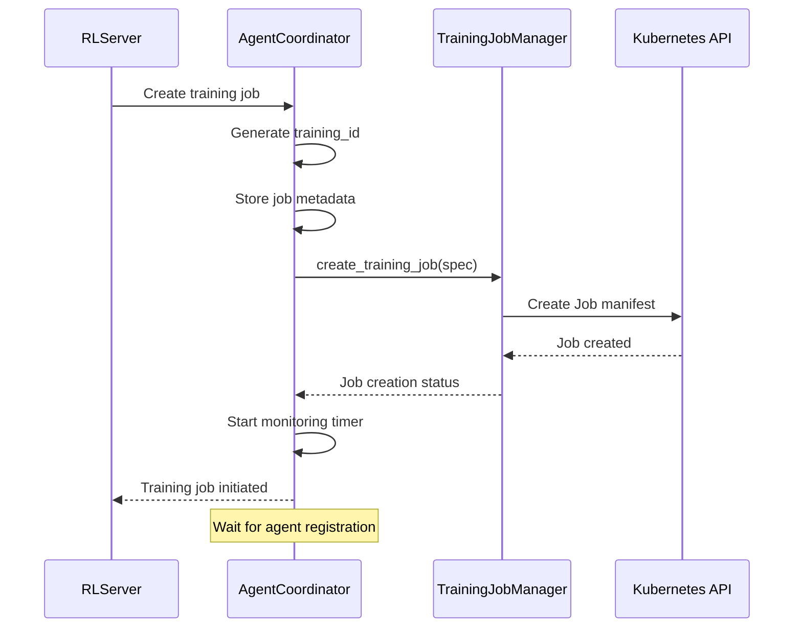
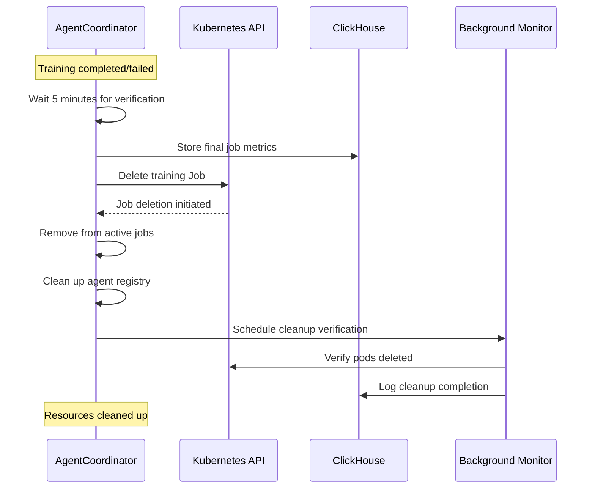

# AgentCoordinator Documentation

The AgentCoordinator is the **training orchestration service** of the Futura Engine. It manages the lifecycle of ephemeral training pods, coordinates distributed training jobs, and ensures proper cleanup after training completion.

## 🎯 Service Overview

**Primary Role**: Training Job Lifecycle Management
**Port**: 50051 (can be distributed)
**Protocol**: gRPC
**Location**: `services/agent_coordinator.py`

## 🏗️ Architecture Role



## 📋 Service Interface

### gRPC Methods

#### 1. `RegisterAgent`

**Purpose**: Training pods register themselves with the coordinator

```protobuf
rpc RegisterAgent(RegisterAgentRequest) returns (RegisterAgentResponse);
```

**Request Parameters**:

- `training_id`: Unique training job identifier
- `agent_id`: Pod-specific identifier
- `capabilities`: Training capabilities (PPO, Meta-PPO, etc.)
- `resources`: Available CPU/GPU/memory
- `version`: Training container version

**Response**:

- `accepted`: Whether registration was successful
- `coordinator_id`: Coordinator instance identifier
- `heartbeat_interval_seconds`: How often to send heartbeats

**Registration Flow**:



#### 2. `FetchTrainingSpec`

**Purpose**: Retrieve training configuration for a specific job

```protobuf
rpc FetchTrainingSpec(FetchTrainingSpecRequest) returns (FetchTrainingSpecResponse);
```

**Request Parameters**:

- `training_id`: Training job identifier
- `agent_id`: Requesting agent identifier

**Response**:

- `spec`: Complete training specification
- `data_sources`: ClickHouse connection details
- `output_config`: Where to save results
- `hyperparameters`: Training hyperparameters
- `model_config`: Model architecture settings

**Spec Fetching Flow**:



#### 3. `ReportProgress`

**Purpose**: Training pods report their progress

```protobuf
rpc ReportProgress(ReportProgressRequest) returns (ReportProgressResponse);
```

**Request Parameters**:

- `training_id`: Training job identifier
- `agent_id`: Reporting agent identifier
- `epoch`: Current training epoch
- `loss`: Current loss value
- `metrics`: Training metrics (accuracy, reward, etc.)
- `estimated_completion`: ETA for completion

**Response**:

- `continue_training`: Whether to continue or stop
- `updated_config`: Any configuration changes

**Progress Monitoring Flow**:



#### 4. `ReportResult`

**Purpose**: Final training results submission

```protobuf
rpc ReportResult(ReportResultRequest) returns (ReportResultResponse);
```

**Request Parameters**:

- `training_id`: Training job identifier
- `agent_id`: Reporting agent identifier
- `success`: Whether training completed successfully
- `final_metrics`: Final model performance metrics
- `model_checkpoint_uri`: S3/PVC path to saved model
- `training_logs`: Summary logs
- `duration_seconds`: Total training time

**Response**:

- `acknowledged`: Result received
- `cleanup_instructions`: What the pod should clean up

**Result Reporting Flow**:



#### 5. `Heartbeat`

**Purpose**: Agent liveness monitoring

```protobuf
rpc Heartbeat(HeartbeatRequest) returns (HeartbeatResponse);
```

**Request Parameters**:

- `training_id`: Training job identifier
- `agent_id`: Agent identifier
- `status`: Current agent status
- `resource_usage`: CPU/memory/GPU utilization

**Response**:

- `alive`: Coordinator acknowledgment
- `instructions`: Any new instructions

#### 6. `CancelTraining`

**Purpose**: Cancel active training jobs

```protobuf
rpc CancelTraining(CancelTrainingRequest) returns (CancelTrainingResponse);
```

**Request Parameters**:

- `training_id`: Training job to cancel
- `reason`: Cancellation reason

**Response**:

- `cancelled`: Whether cancellation succeeded
- `agents_notified`: Number of agents notified

## 🧠 Internal Logic & Job Management

### Training Job State Machine



### Agent Registry Management

```python
# Example agent registry structure
class AgentRegistry:
    def __init__(self):
        self.active_agents: Dict[str, AgentInfo] = {}
        self.training_jobs: Dict[str, TrainingJobInfo] = {}
        self.heartbeat_tracker: Dict[str, datetime] = {}

    def register_agent(self, training_id: str, agent_id: str, capabilities: List[str]) -> bool:
        """Register a new training agent."""
        if training_id not in self.training_jobs:
            return False  # Unknown training job

        agent_info = AgentInfo(
            agent_id=agent_id,
            training_id=training_id,
            capabilities=capabilities,
            status="registered",
            registered_at=datetime.utcnow()
        )

        self.active_agents[agent_id] = agent_info
        self.heartbeat_tracker[agent_id] = datetime.utcnow()

        # Update training job status
        self.training_jobs[training_id].status = "agent_registered"
        return True

    def check_agent_health(self) -> List[str]:
        """Identify unhealthy agents based on heartbeat."""
        unhealthy_agents = []
        threshold = datetime.utcnow() - timedelta(minutes=5)

        for agent_id, last_heartbeat in self.heartbeat_tracker.items():
            if last_heartbeat < threshold:
                unhealthy_agents.append(agent_id)

        return unhealthy_agents
```

### Resource Monitoring



## 🔧 Training Job Lifecycle

### Job Creation Process



### Kubernetes Job Template

```yaml
# Generated by TrainingJobManager
apiVersion: batch/v1
kind: Job
metadata:
  name: futura-train-${app_key}-${timestamp}
  namespace: futura-training
  labels:
    futura.io/training-id: ${training_id}
    futura.io/app-key: ${app_key}
    futura.io/job-type: training
spec:
  completions: 1
  parallelism: 1
  backoffLimit: 2

  template:
    metadata:
      labels:
        futura.io/training-id: ${training_id}
        futura.io/component: trainer

    spec:
      restartPolicy: Never
      serviceAccountName: futura-trainer

      containers:
        - name: trainer
          image: futura/rl-trainer:latest
          imagePullPolicy: Always

          env:
            # Coordinator connection
            - name: COORDINATOR_ENDPOINT
              value: "futura-engine.futura-system:50051"
            - name: TRAINING_ID
              value: ${training_id}
            - name: AGENT_ID
              valueFrom:
                fieldRef:
                  fieldPath: metadata.name

            # Data sources
            - name: CLICKHOUSE_DSN
              value: "http://clickhouse.futura-system:8123/engine"
            - name: ANALYTICS_DSN
              value: "http://clickhouse.futura-system:8123/analytics"

            # Storage
            - name: CHECKPOINT_URI
              value: ${checkpoint_uri}
            - name: S3_BUCKET
              value: ${s3_bucket}

            # Training configuration
            - name: APP_KEY
              value: ${app_key}
            - name: HORIZON_HOURS
              value: ${horizon_hours}
            - name: USE_META_LEARNING
              value: ${use_meta_learning}

            # Hyperparameters
            - name: LEARNING_RATE
              value: ${learning_rate}
            - name: BATCH_SIZE
              value: ${batch_size}
            - name: EPOCHS
              value: ${epochs}
            - name: GAMMA
              value: ${gamma}
            - name: CLIP_EPSILON
              value: ${clip_epsilon}

          resources:
            requests:
              cpu: ${cpu_request}
              memory: ${memory_request}
            limits:
              cpu: ${cpu_limit}
              memory: ${memory_limit}
              nvidia.com/gpu: ${gpu_limit} # Optional

          volumeMounts:
            - name: training-data
              mountPath: /tmp/training
            - name: model-storage
              mountPath: /tmp/models

      volumes:
        - name: training-data
          emptyDir:
            sizeLimit: 10Gi
        - name: model-storage
          emptyDir:
            sizeLimit: 5Gi

      # Optional: Node affinity for GPU nodes
      nodeSelector:
        futura.io/node-type: training
```

### Cleanup Process



## 📊 Monitoring & Observability

### Key Metrics

```yaml
# Prometheus metrics exposed
- futura_training_jobs_total{status, app_key}
- futura_training_duration_seconds{app_key, model_type}
- futura_training_agents_active{training_id}
- futura_training_failures_total{reason, app_key}
- futura_agent_heartbeat_age_seconds{agent_id}
- futura_training_resource_usage{resource_type, training_id}
```

### Health Checks

```python
class AgentCoordinatorHealthCheck:
    def __init__(self, coordinator):
        self.coordinator = coordinator

    async def check_health(self) -> Dict[str, Any]:
        """Comprehensive health check."""
        health = {
            "status": "healthy",
            "active_jobs": len(self.coordinator.training_jobs),
            "active_agents": len(self.coordinator.active_agents),
            "services": {
                "kubernetes": await self._check_kubernetes_connection(),
                "clickhouse": await self._check_clickhouse_connection(),
                "s3": await self._check_s3_connection()
            },
            "resource_usage": {
                "cpu_percent": psutil.cpu_percent(),
                "memory_percent": psutil.virtual_memory().percent
            }
        }

        # Check for unhealthy agents
        unhealthy_agents = self.coordinator.check_agent_health()
        if unhealthy_agents:
            health["warnings"] = [f"Unhealthy agents: {unhealthy_agents}"]

        # Check for stuck jobs
        stuck_jobs = self.coordinator.check_stuck_jobs()
        if stuck_jobs:
            health["warnings"] = health.get("warnings", [])
            health["warnings"].append(f"Stuck jobs: {stuck_jobs}")

        return health
```

### Log Structure

```json
{
  "timestamp": "2025-01-XX...",
  "service": "agent_coordinator",
  "level": "INFO",
  "operation": "agent_registration",
  "training_id": "uuid-123",
  "agent_id": "pod-456",
  "app_key": "default/web-app",
  "capabilities": ["ppo", "meta-ppo"],
  "resources": {
    "cpu_cores": 4,
    "memory_gb": 8,
    "gpu_count": 0
  },
  "message": "Training agent registered successfully"
}

{
  "timestamp": "2025-01-XX...",
  "service": "agent_coordinator",
  "level": "INFO",
  "operation": "training_completion",
  "training_id": "uuid-123",
  "agent_id": "pod-456",
  "duration_minutes": 45,
  "final_metrics": {
    "loss": 0.023,
    "avg_reward": 8.7,
    "episodes": 1000
  },
  "checkpoint_uri": "s3://futura-models/default-web-app/uuid-123/model.pth",
  "message": "Training completed successfully"
}
```

## 🔧 Configuration & Environment

### Environment Variables

```bash
# Service Configuration
FUTURA_PORT=50051
FUTURA_MAX_WORKERS=50

# Kubernetes Configuration
FUTURA_TRAINING_NAMESPACE=futura-training
FUTURA_TRAINING_IMAGE=futura/rl-trainer:latest
FUTURA_TRAINING_SERVICE_ACCOUNT=futura-trainer

# Job Management
FUTURA_MAX_TRAINING_JOB_AGE_HOURS=24
FUTURA_CLEANUP_INTERVAL_HOURS=1
FUTURA_HEARTBEAT_TIMEOUT_MINUTES=5
FUTURA_MAX_CONCURRENT_JOBS=10

# Storage Configuration
FUTURA_CLICKHOUSE_DSN=http://localhost:8123/engine
FUTURA_S3_BUCKET=futura-models
FUTURA_MODEL_STORAGE_PREFIX=models

# Resource Limits
FUTURA_DEFAULT_CPU_REQUEST=2
FUTURA_DEFAULT_MEMORY_REQUEST=4Gi
FUTURA_DEFAULT_CPU_LIMIT=4
FUTURA_DEFAULT_MEMORY_LIMIT=8Gi
```

### RBAC Requirements

```yaml
# ServiceAccount for AgentCoordinator
apiVersion: v1
kind: ServiceAccount
metadata:
  name: futura-coordinator
  namespace: futura-system

---
# ClusterRole for job management
apiVersion: rbac.authorization.k8s.io/v1
kind: ClusterRole
metadata:
  name: futura-coordinator
rules:
  - apiGroups: ["batch"]
    resources: ["jobs"]
    verbs: ["create", "get", "list", "watch", "update", "patch", "delete"]

  - apiGroups: [""]
    resources: ["pods"]
    verbs: ["get", "list", "watch", "delete"]

  - apiGroups: [""]
    resources: ["pods/log"]
    verbs: ["get"]

  - apiGroups: [""]
    resources: ["events"]
    verbs: ["create"]

---
# ServiceAccount for training pods
apiVersion: v1
kind: ServiceAccount
metadata:
  name: futura-trainer
  namespace: futura-training

---
# Role for training pods
apiVersion: rbac.authorization.k8s.io/v1
kind: Role
metadata:
  name: futura-trainer
  namespace: futura-training
rules:
  - apiGroups: [""]
    resources: ["secrets", "configmaps"]
    verbs: ["get", "list"]

  - apiGroups: [""]
    resources: ["events"]
    verbs: ["create"]
```

## 🚀 Development & Testing

### Local Development

```bash
# Start AgentCoordinator with other services
uv run main.py

# Start only AgentCoordinator (distributed mode)
uv run server.py --services coordinator --port 50051
```

### Testing Training Jobs

```python
import grpc
from proto.gen.engine import engine_pb2_grpc, engine_pb2

# Connect to coordinator
channel = grpc.insecure_channel('localhost:50051')
client = engine_pb2_grpc.AgentCoordinatorStub(channel)

# Simulate agent registration
register_response = client.RegisterAgent(
    engine_pb2.RegisterAgentRequest(
        training_id="test-123",
        agent_id="test-agent",
        capabilities=["ppo", "meta-ppo"],
        resources={
            "cpu_cores": "4",
            "memory_gb": "8",
            "gpu_count": "0"
        },
        version="v1.0.0"
    )
)

print(f"Registration accepted: {register_response.accepted}")

# Fetch training spec
spec_response = client.FetchTrainingSpec(
    engine_pb2.FetchTrainingSpecRequest(
        training_id="test-123",
        agent_id="test-agent"
    )
)

print(f"Training spec: {spec_response.spec}")

# Report progress
progress_response = client.ReportProgress(
    engine_pb2.ReportProgressRequest(
        training_id="test-123",
        agent_id="test-agent",
        epoch=10,
        loss=0.5,
        metrics={
            "accuracy": "0.85",
            "reward": "5.2"
        },
        estimated_completion="2025-01-XX..."
    )
)

print(f"Continue training: {progress_response.continue_training}")
```

### Mock Training Container

```python
#!/usr/bin/env python3
"""Mock training container for testing."""

import os
import time
import grpc
from proto.gen.engine import engine_pb2_grpc, engine_pb2

class MockTrainer:
    def __init__(self):
        self.coordinator_endpoint = os.getenv("COORDINATOR_ENDPOINT", "localhost:50051")
        self.training_id = os.getenv("TRAINING_ID", "test-123")
        self.agent_id = os.getenv("AGENT_ID", "test-agent")

    def run(self):
        # Connect to coordinator
        channel = grpc.insecure_channel(self.coordinator_endpoint)
        client = engine_pb2_grpc.AgentCoordinatorStub(channel)

        # Register agent
        register_response = client.RegisterAgent(
            engine_pb2.RegisterAgentRequest(
                training_id=self.training_id,
                agent_id=self.agent_id,
                capabilities=["ppo"],
                resources={"cpu_cores": "2", "memory_gb": "4"}
            )
        )

        if not register_response.accepted:
            print("Registration failed")
            return

        # Fetch training spec
        spec_response = client.FetchTrainingSpec(
            engine_pb2.FetchTrainingSpecRequest(
                training_id=self.training_id,
                agent_id=self.agent_id
            )
        )

        print(f"Training spec: {spec_response.spec}")

        # Simulate training
        for epoch in range(100):
            time.sleep(1)  # Simulate training time

            # Report progress
            client.ReportProgress(
                engine_pb2.ReportProgressRequest(
                    training_id=self.training_id,
                    agent_id=self.agent_id,
                    epoch=epoch,
                    loss=1.0 - (epoch * 0.01),  # Decreasing loss
                    metrics={"reward": str(epoch * 0.1)}
                )
            )

            # Send heartbeat
            client.Heartbeat(
                engine_pb2.HeartbeatRequest(
                    training_id=self.training_id,
                    agent_id=self.agent_id,
                    status="training"
                )
            )

        # Report final results
        client.ReportResult(
            engine_pb2.ReportResultRequest(
                training_id=self.training_id,
                agent_id=self.agent_id,
                success=True,
                final_metrics={"loss": "0.01", "reward": "10.0"},
                model_checkpoint_uri=f"s3://test-bucket/{self.training_id}/model.pth",
                duration_seconds=100
            )
        )

        print("Training completed")

if __name__ == "__main__":
    trainer = MockTrainer()
    trainer.run()
```

## 🔗 Related Documentation

- **[RLServer](./rl-server.md)**: Training trigger and model management
- **[Training Pipeline](./training-pipeline.md)**: End-to-end training workflow
- **[Kubernetes Jobs](./kubernetes-jobs.md)**: Job creation and management details
- **[PyTorch Models](./pytorch-models.md)**: What models are being trained
