# Futura Engine Architecture

This document provides a comprehensive overview of the Futura Engine's architecture, data flows, and component interactions.

## 🏗️ High-Level Architecture

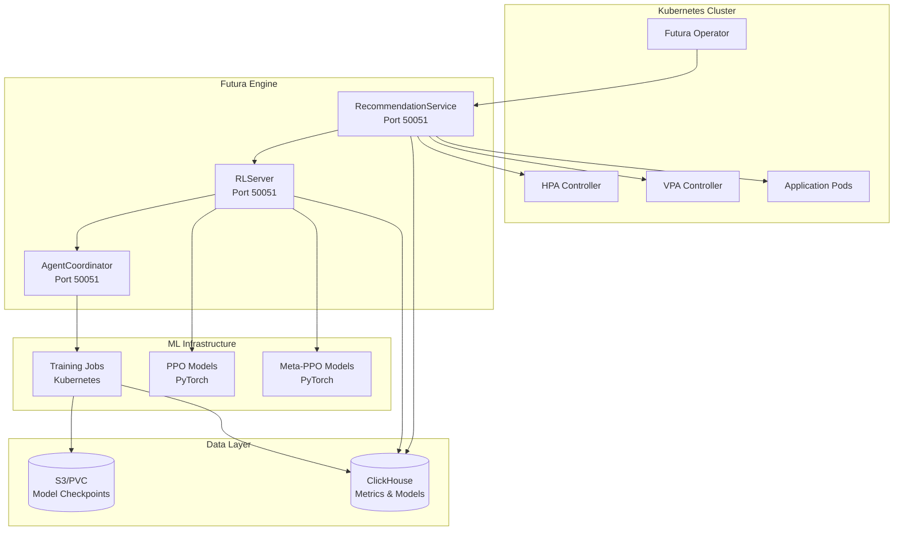

## 🎯 Core Services Overview

### RecommendationService (MPA Server)

**Primary Role**: Orchestration and safety enforcement

- **Port**: 50051 (main API endpoint)
- **Purpose**: Receives optimization requests from Kubernetes operator
- **Key Features**:
  - SLO validation and enforcement
  - Safety policy application
  - Intelligent fallback to HPA/VPA algorithms
  - Audit trail generation

### RLServer (Control Plane)

**Primary Role**: ML model serving and lifecycle management

- **Port**: 50051 (can be distributed)
- **Purpose**: PyTorch neural network inference and training orchestration
- **Key Features**:
  - Real-time neural network inference
  - PPO and Meta-PPO model serving
  - CUDA/CPU automatic device detection
  - Model checkpointing and versioning

### AgentCoordinator (Training Orchestration)

**Primary Role**: Training job lifecycle management

- **Port**: 50051 (can be distributed)
- **Purpose**: Manages ephemeral training pods and their coordination
- **Key Features**:
  - Kubernetes Job creation and monitoring
  - Training progress tracking
  - Automatic cleanup and result storage

## 🔄 End-to-End Data Flow

### 1. Application Onboarding Flow

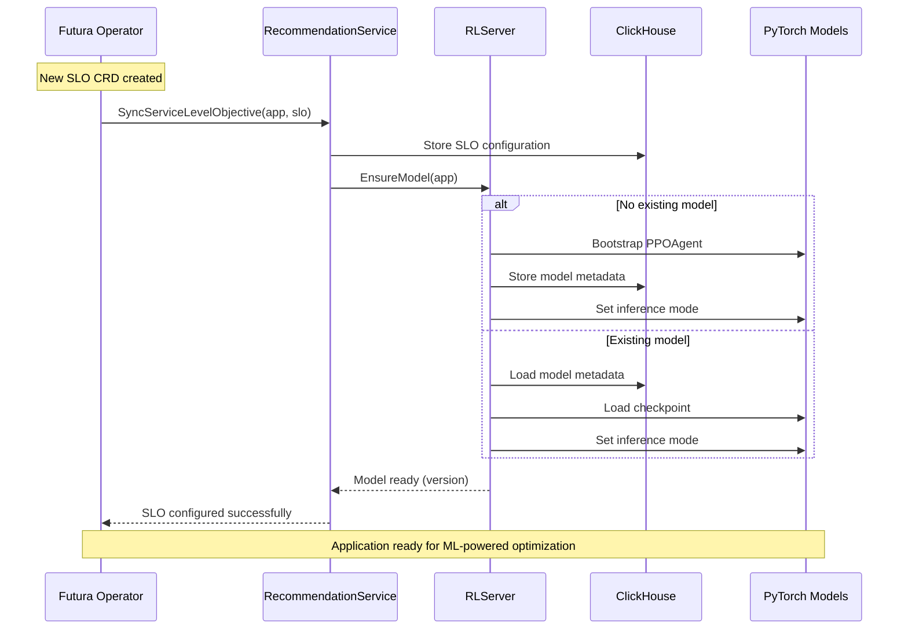

### 2. Real-Time Recommendation Flow

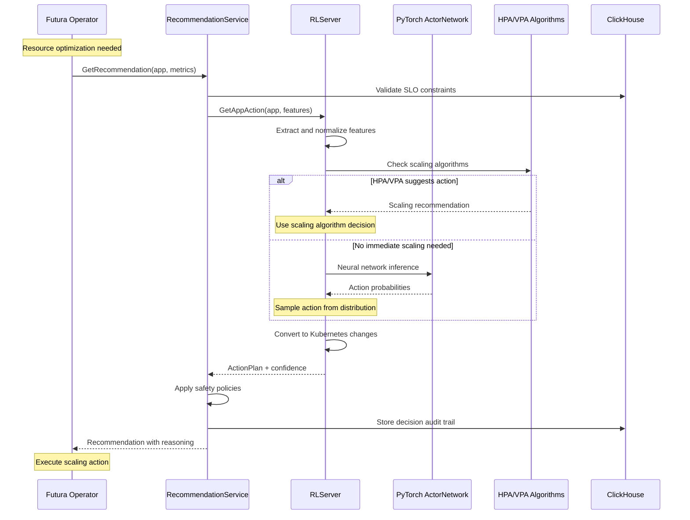

### 3. Training Pipeline Flow

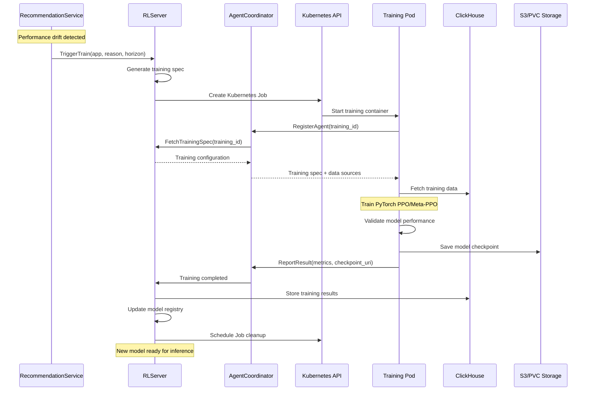

## 📊 Data Architecture

### ClickHouse Schema Overview

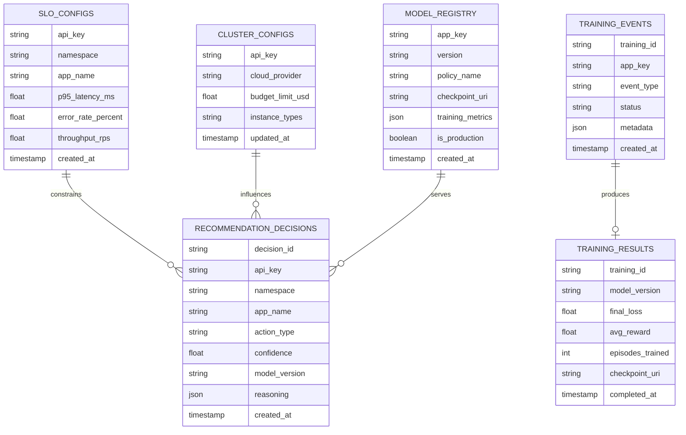

### Model Storage Architecture

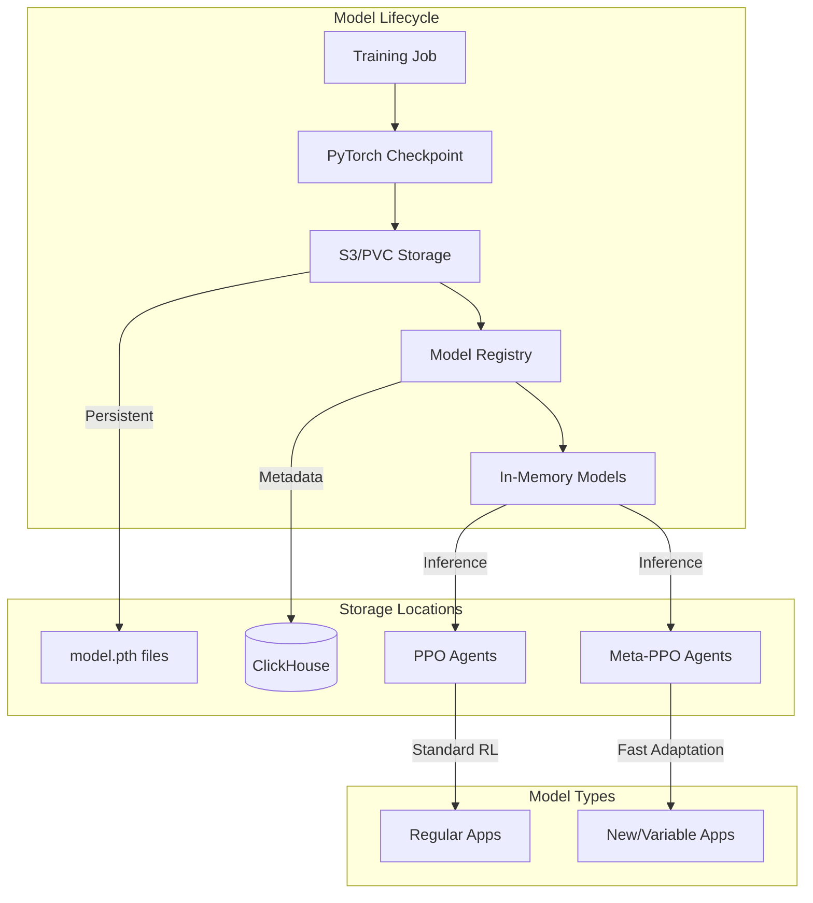

## 🚀 Deployment Architectures

### Single Process (Development)

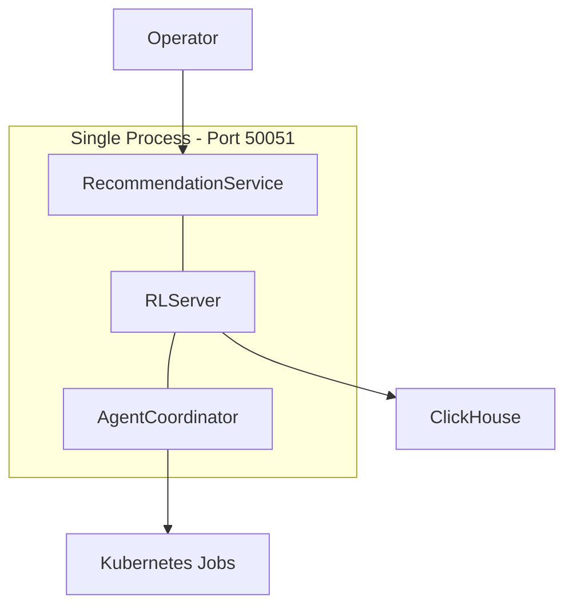

**Use Case**: Development, testing, small clusters
**Command**: `uv run main.py --port 50051`

### Distributed (Production)

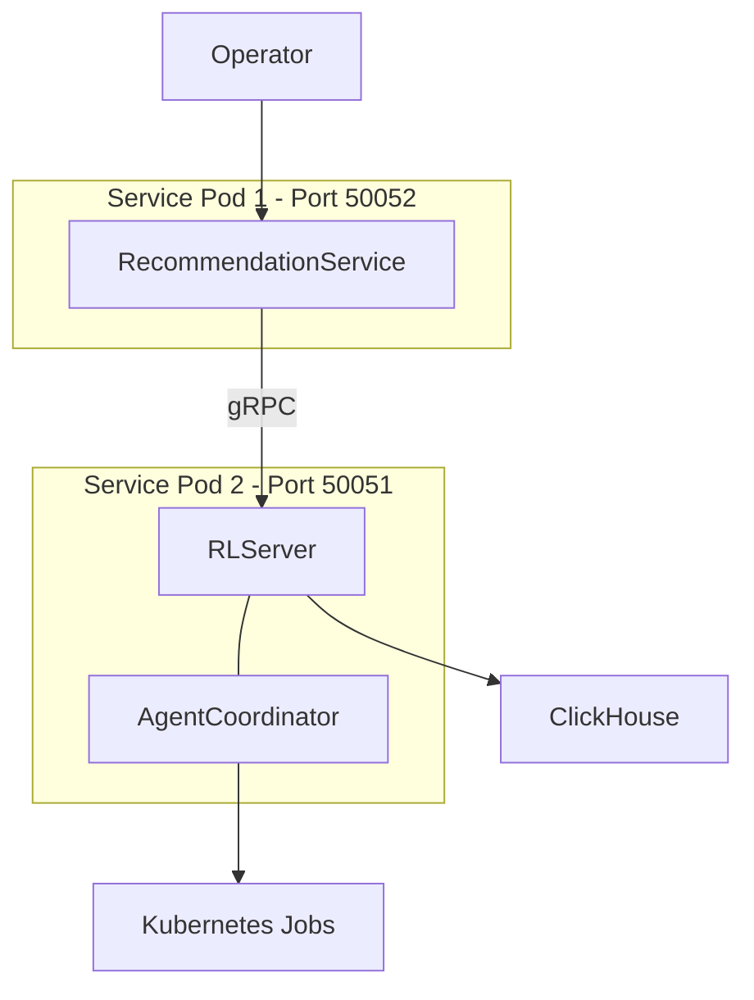

**Use Case**: Production, high availability, load distribution
**Commands**:

```bash
# Pod 1
uv run server.py --services recommendation --port 50052 --rl-server-address service2:50051

# Pod 2
uv run server.py --services rl+coordinator --port 50051
```

## 🔧 Component Integration Patterns

### Service Discovery

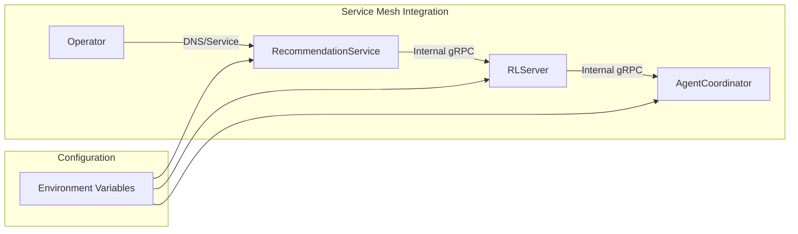

### Error Handling & Resilience

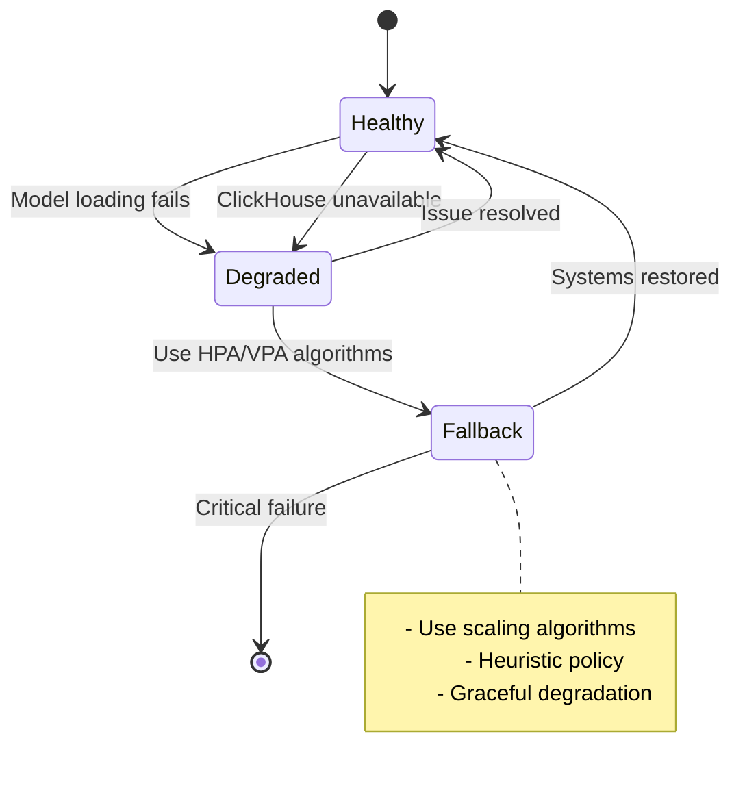

## 📈 Performance & Scaling

### Inference Performance

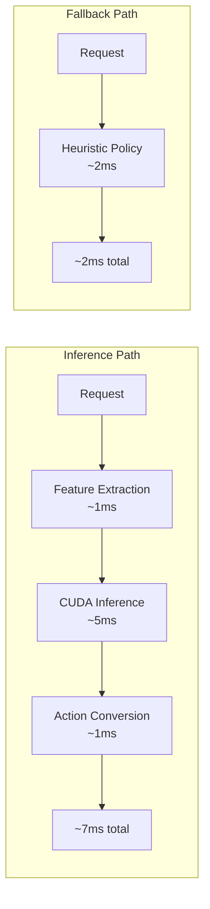

### Horizontal Scaling

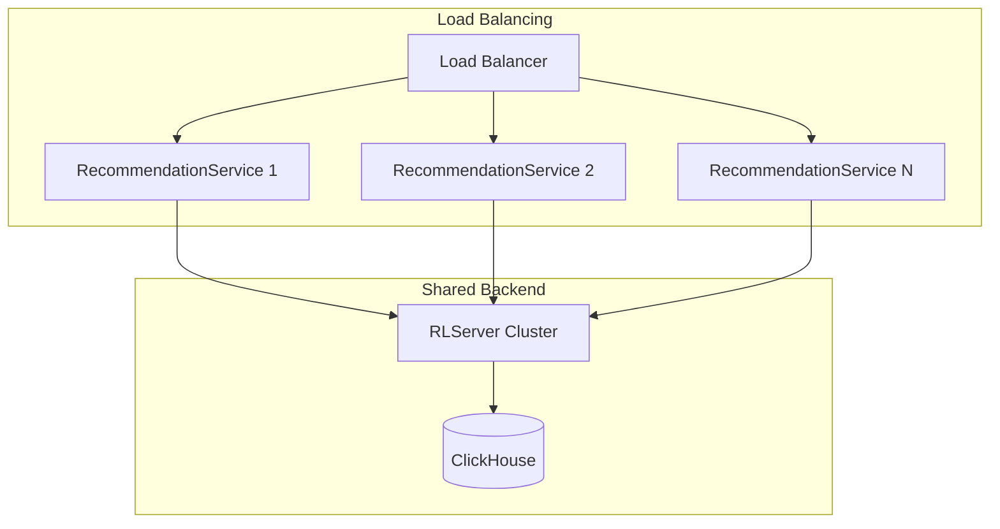

## 🔒 Security Considerations

### Network Security

- **Internal gRPC**: TLS encryption between services
- **ClickHouse**: Authentication and network policies
- **S3/PVC**: IAM roles and encryption at rest

### Model Security

- **Checkpoint Validation**: SHA256 verification
- **Access Control**: RBAC for training jobs
- **Audit Logging**: All model operations logged

### Data Privacy

- **PII Handling**: No personal data in metrics
- **Metric Aggregation**: Only cluster-level analytics
- **Retention Policies**: Automatic data cleanup

## 🎯 Next Steps

- **[Service Documentation](./recommendation-service.md)**: Deep dive into individual services
- **[Operator Integration](./operator-integration.md)**: How external systems interact
- **[PyTorch Models](./pytorch-models.md)**: ML model implementation details
- **[Training Pipeline](./training-pipeline.md)**: End-to-end training workflow
