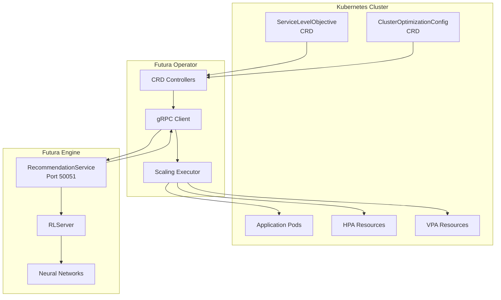
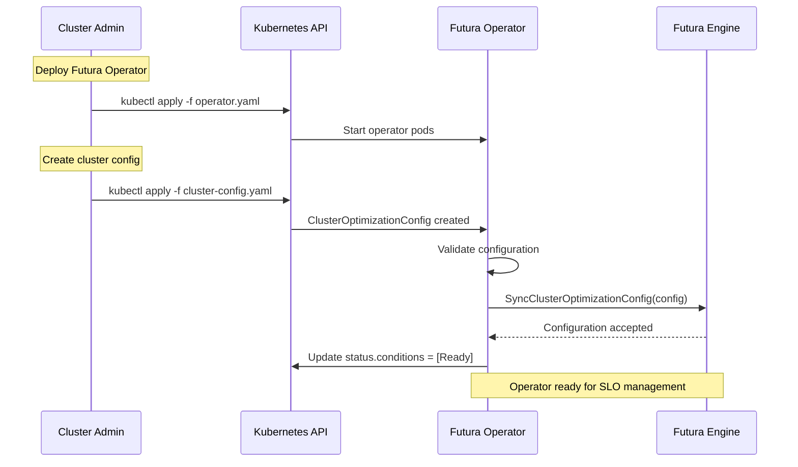
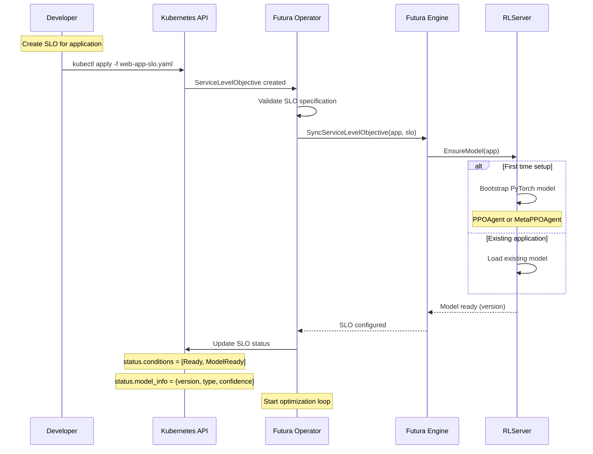
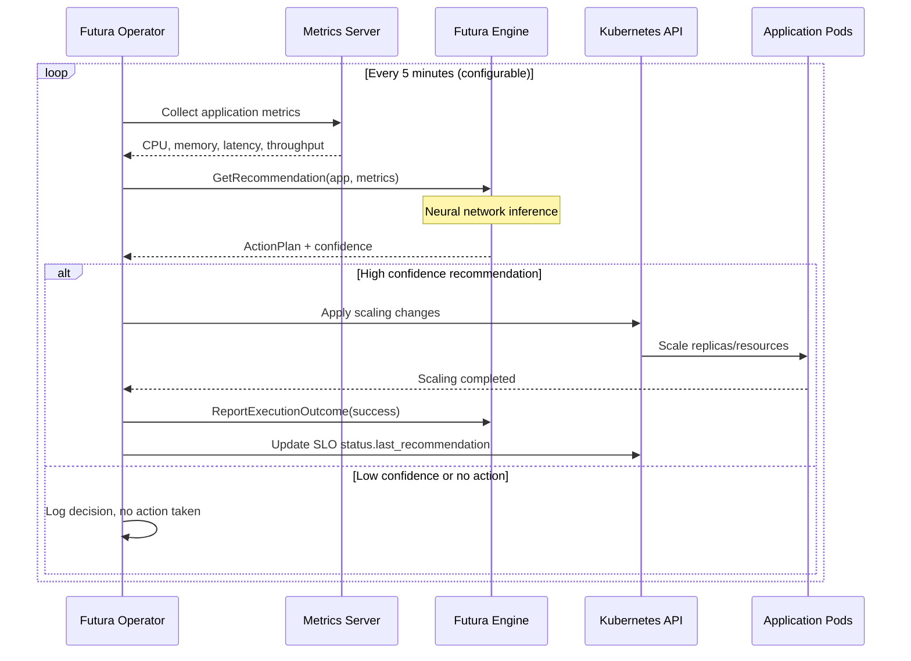
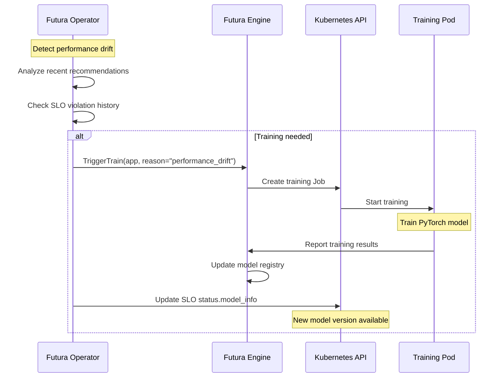

# Operator Integration Documentation

This document explains how the **Futura Kubernetes Operator** interacts with the **Futura Engine** through gRPC APIs, including the management of SLO and ClusterOptimizationConfig objects.

## 🎯 Overview

The Futura Operator acts as the bridge between Kubernetes and the Futura Engine, translating Custom Resource Definitions (CRDs) into gRPC calls and executing scaling recommendations.



## 📋 Custom Resource Definitions (CRDs)

### ServiceLevelObjective CRD

```yaml
apiVersion: apiextensions.k8s.io/v1
kind: CustomResourceDefinition
metadata:
  name: servicelevelobjectives.futura.io
spec:
  group: futura.io
  versions:
    - name: v1
      served: true
      storage: true
      schema:
        openAPIV3Schema:
          type: object
          properties:
            spec:
              type: object
              properties:
                # Target application
                target:
                  type: object
                  properties:
                    apiVersion:
                      type: string
                      example: "apps/v1"
                    kind:
                      type: string
                      enum: ["Deployment", "StatefulSet", "DaemonSet"]
                    name:
                      type: string
                    namespace:
                      type: string

                # Performance objectives
                objectives:
                  type: object
                  properties:
                    latency:
                      type: object
                      properties:
                        p95_ms:
                          type: number
                          minimum: 0
                          example: 200
                        p99_ms:
                          type: number
                          minimum: 0
                          example: 500

                    availability:
                      type: object
                      properties:
                        error_rate_percent:
                          type: number
                          minimum: 0
                          maximum: 100
                          example: 1.0
                        uptime_percent:
                          type: number
                          minimum: 0
                          maximum: 100
                          example: 99.9

                    throughput:
                      type: object
                      properties:
                        requests_per_second:
                          type: number
                          minimum: 0
                          example: 1000
                        min_capacity_percent:
                          type: number
                          minimum: 0
                          maximum: 100
                          example: 80

                # Optimization settings
                optimization:
                  type: object
                  properties:
                    enabled:
                      type: boolean
                      default: true

                    scaling_policy:
                      type: string
                      enum: ["conservative", "aggressive", "balanced"]
                      default: "balanced"

                    ml_model_preference:
                      type: string
                      enum: ["ppo", "meta-ppo", "auto"]
                      default: "auto"

                    constraints:
                      type: object
                      properties:
                        min_replicas:
                          type: integer
                          minimum: 1
                          default: 1
                        max_replicas:
                          type: integer
                          minimum: 1
                          default: 20
                        min_cpu_millicores:
                          type: integer
                          minimum: 100
                          default: 200
                        max_cpu_millicores:
                          type: integer
                          minimum: 100
                          default: 4000
                        min_memory_mb:
                          type: integer
                          minimum: 128
                          default: 256
                        max_memory_mb:
                          type: integer
                          minimum: 128
                          default: 8192

            status:
              type: object
              properties:
                conditions:
                  type: array
                  items:
                    type: object
                    properties:
                      type:
                        type: string
                        enum: ["Ready", "Synced", "ModelReady", "Error"]
                      status:
                        type: string
                        enum: ["True", "False", "Unknown"]
                      reason:
                        type: string
                      message:
                        type: string
                      lastTransitionTime:
                        type: string
                        format: date-time

                model_info:
                  type: object
                  properties:
                    version:
                      type: string
                    type:
                      type: string
                      enum: ["ppo", "meta-ppo"]
                    confidence:
                      type: number
                    last_trained:
                      type: string
                      format: date-time

                last_recommendation:
                  type: object
                  properties:
                    decision_id:
                      type: string
                    timestamp:
                      type: string
                      format: date-time
                    action:
                      type: string
                    confidence:
                      type: number
                    executed:
                      type: boolean
  scope: Namespaced
  names:
    plural: servicelevelobjectives
    singular: servicelevelobjective
    kind: ServiceLevelObjective
    shortNames:
      - slo
```

### ClusterOptimizationConfig CRD

```yaml
apiVersion: apiextensions.k8s.io/v1
kind: CustomResourceDefinition
metadata:
  name: clusteroptimizationconfigs.futura.io
spec:
  group: futura.io
  versions:
    - name: v1
      served: true
      storage: true
      schema:
        openAPIV3Schema:
          type: object
          properties:
            spec:
              type: object
              properties:
                # Cloud provider configuration
                cloud:
                  type: object
                  properties:
                    provider:
                      type: string
                      enum: ["aws", "gcp", "azure", "on-premise"]
                    region:
                      type: string
                      example: "us-west-2"
                    zones:
                      type: array
                      items:
                        type: string
                      example: ["us-west-2a", "us-west-2b", "us-west-2c"]

                # Budget constraints
                budget:
                  type: object
                  properties:
                    enabled:
                      type: boolean
                      default: false
                    monthly_limit_usd:
                      type: number
                      minimum: 0
                    cost_per_cpu_hour:
                      type: number
                      minimum: 0
                    cost_per_gb_memory_hour:
                      type: number
                      minimum: 0
                    alert_threshold_percent:
                      type: number
                      minimum: 0
                      maximum: 100
                      default: 80

                # Instance type preferences
                compute:
                  type: object
                  properties:
                    instance_types:
                      type: array
                      items:
                        type: string
                      example: ["t3.medium", "t3.large", "c5.xlarge"]

                    node_groups:
                      type: array
                      items:
                        type: object
                        properties:
                          name:
                            type: string
                          instance_type:
                            type: string
                          min_size:
                            type: integer
                            minimum: 0
                          max_size:
                            type: integer
                            minimum: 1
                          spot_enabled:
                            type: boolean
                            default: false

                # ML engine configuration
                engine:
                  type: object
                  properties:
                    endpoint:
                      type: string
                      default: "futura-engine:50051"

                    training:
                      type: object
                      properties:
                        enabled:
                          type: boolean
                          default: true
                        schedule:
                          type: string
                          example: "0 2 * * *" # Daily at 2 AM
                        trigger_threshold:
                          type: object
                          properties:
                            performance_degradation_percent:
                              type: number
                              default: 10
                            slo_violation_count:
                              type: integer
                              default: 5

                    optimization:
                      type: object
                      properties:
                        recommendation_frequency_seconds:
                          type: integer
                          minimum: 30
                          default: 300 # 5 minutes

                        safety_policies:
                          type: object
                          properties:
                            max_scaling_frequency_minutes:
                              type: integer
                              default: 10
                            confidence_threshold:
                              type: number
                              minimum: 0
                              maximum: 1
                              default: 0.7

                            fallback_strategy:
                              type: string
                              enum: ["hpa", "vpa", "conservative", "none"]
                              default: "hpa"

            status:
              type: object
              properties:
                conditions:
                  type: array
                  items:
                    type: object
                    properties:
                      type:
                        type: string
                        enum: ["Ready", "Synced", "EngineConnected", "Error"]
                      status:
                        type: string
                        enum: ["True", "False", "Unknown"]
                      reason:
                        type: string
                      message:
                        type: string
                      lastTransitionTime:
                        type: string
                        format: date-time

                engine_status:
                  type: object
                  properties:
                    connected:
                      type: boolean
                    last_sync:
                      type: string
                      format: date-time
                    version:
                      type: string
                    services:
                      type: array
                      items:
                        type: string
                      example: ["recommendation", "rl", "coordinator"]

                cluster_metrics:
                  type: object
                  properties:
                    total_applications:
                      type: integer
                    active_slos:
                      type: integer
                    ml_models_loaded:
                      type: integer
                    last_optimization:
                      type: string
                      format: date-time
  scope: Cluster
  names:
    plural: clusteroptimizationconfigs
    singular: clusteroptimizationconfig
    kind: ClusterOptimizationConfig
    shortNames:
      - coc
```

## 🔄 Operator Workflow

### 1. Initialization Flow



### 2. SLO Management Flow



### 3. Continuous Optimization Flow



### 4. Training Trigger Flow



## 📝 Example Resource Definitions

### Complete SLO Example

```yaml
apiVersion: futura.io/v1
kind: ServiceLevelObjective
metadata:
  name: web-app-slo
  namespace: production
spec:
  target:
    apiVersion: apps/v1
    kind: Deployment
    name: web-app
    namespace: production

  objectives:
    latency:
      p95_ms: 200
      p99_ms: 500

    availability:
      error_rate_percent: 1.0
      uptime_percent: 99.9

    throughput:
      requests_per_second: 1000
      min_capacity_percent: 80

  optimization:
    enabled: true
    scaling_policy: balanced
    ml_model_preference: auto

    constraints:
      min_replicas: 2
      max_replicas: 20
      min_cpu_millicores: 500
      max_cpu_millicores: 2000
      min_memory_mb: 512
      max_memory_mb: 4096

status:
  conditions:
    - type: Ready
      status: "True"
      reason: ConfigurationValid
      message: SLO successfully configured
      lastTransitionTime: "2025-01-XX..."

    - type: ModelReady
      status: "True"
      reason: ModelLoaded
      message: PPO model v1.2.3 loaded successfully
      lastTransitionTime: "2025-01-XX..."

  model_info:
    version: v1.2.3
    type: ppo
    confidence: 0.87
    last_trained: "2025-01-XX..."

  last_recommendation:
    decision_id: uuid-456
    timestamp: "2025-01-XX..."
    action: vertical_cpu_up
    confidence: 0.85
    executed: true
```

### Complete ClusterOptimizationConfig Example

```yaml
apiVersion: futura.io/v1
kind: ClusterOptimizationConfig
metadata:
  name: production-cluster
spec:
  cloud:
    provider: aws
    region: us-west-2
    zones:
      - us-west-2a
      - us-west-2b
      - us-west-2c

  budget:
    enabled: true
    monthly_limit_usd: 10000
    cost_per_cpu_hour: 0.048
    cost_per_gb_memory_hour: 0.0051
    alert_threshold_percent: 80

  compute:
    instance_types:
      - t3.medium
      - t3.large
      - c5.xlarge
      - m5.large

    node_groups:
      - name: general-purpose
        instance_type: t3.large
        min_size: 2
        max_size: 10
        spot_enabled: false

      - name: compute-optimized
        instance_type: c5.xlarge
        min_size: 0
        max_size: 5
        spot_enabled: true

  engine:
    endpoint: futura-engine.futura-system:50051

    training:
      enabled: true
      schedule: "0 2 * * *" # Daily at 2 AM
      trigger_threshold:
        performance_degradation_percent: 15
        slo_violation_count: 3

    optimization:
      recommendation_frequency_seconds: 300 # 5 minutes

      safety_policies:
        max_scaling_frequency_minutes: 10
        confidence_threshold: 0.7
        fallback_strategy: hpa

status:
  conditions:
    - type: Ready
      status: "True"
      reason: ConfigurationValid
      message: Cluster optimization configuration applied
      lastTransitionTime: "2025-01-XX..."

    - type: EngineConnected
      status: "True"
      reason: ConnectionEstablished
      message: Successfully connected to Futura Engine
      lastTransitionTime: "2025-01-XX..."

  engine_status:
    connected: true
    last_sync: "2025-01-XX..."
    version: v0.1.0
    services:
      - recommendation
      - rl
      - coordinator

  cluster_metrics:
    total_applications: 15
    active_slos: 12
    ml_models_loaded: 8
    last_optimization: "2025-01-XX..."
```

## 🔧 Operator Implementation Details

### Controller Architecture

```go
// Pseudo-code for operator controllers
type ServiceLevelObjectiveController struct {
    client.Client
    Scheme *runtime.Scheme
    EngineClient futura.RecommendationServiceClient
}

func (r *ServiceLevelObjectiveController) Reconcile(ctx context.Context, req ctrl.Request) (ctrl.Result, error) {
    // 1. Fetch SLO resource
    slo := &futrav1.ServiceLevelObjective{}
    if err := r.Get(ctx, req.NamespacedName, slo); err != nil {
        return ctrl.Result{}, client.IgnoreNotFound(err)
    }

    // 2. Validate SLO specification
    if err := r.validateSLO(slo); err != nil {
        r.updateStatus(ctx, slo, "Error", err.Error())
        return ctrl.Result{}, err
    }

    // 3. Sync with Futura Engine
    response, err := r.EngineClient.SyncServiceLevelObjective(ctx, &engine.SyncServiceLevelObjectiveRequest{
        App: &engine.AppRef{
            ApiKey:    r.getClusterID(),
            Namespace: slo.Spec.Target.Namespace,
            AppName:   slo.Spec.Target.Name,
            Kind:      engine.ResourceKind(slo.Spec.Target.Kind),
        },
        Slo: &engine.ServiceLevelObjective{
            P95LatencyMs:     slo.Spec.Objectives.Latency.P95Ms,
            ErrorRatePercent: slo.Spec.Objectives.Availability.ErrorRatePercent,
            ThroughputRps:    slo.Spec.Objectives.Throughput.RequestsPerSecond,
        },
    })

    if err != nil {
        r.updateStatus(ctx, slo, "Error", err.Error())
        return ctrl.Result{RequeueAfter: time.Minute * 5}, err
    }

    // 4. Update status
    r.updateStatus(ctx, slo, "Ready", "SLO successfully configured")

    // 5. Start optimization loop if not already running
    if !r.isOptimizationRunning(slo) {
        go r.startOptimizationLoop(ctx, slo)
    }

    return ctrl.Result{RequeueAfter: time.Hour}, nil
}

func (r *ServiceLevelObjectiveController) startOptimizationLoop(ctx context.Context, slo *futrav1.ServiceLevelObjective) {
    ticker := time.NewTicker(time.Duration(r.getRecommendationFrequency()) * time.Second)
    defer ticker.Stop()

    for {
        select {
        case <-ctx.Done():
            return
        case <-ticker.C:
            r.performOptimization(ctx, slo)
        }
    }
}

func (r *ServiceLevelObjectiveController) performOptimization(ctx context.Context, slo *futrav1.ServiceLevelObjective) {
    // 1. Collect current metrics
    metrics, err := r.collectMetrics(ctx, slo.Spec.Target)
    if err != nil {
        log.Error(err, "Failed to collect metrics")
        return
    }

    // 2. Get recommendation from Futura Engine
    response, err := r.EngineClient.GetRecommendation(ctx, &engine.RecommendationRequest{
        App: &engine.AppRef{
            ApiKey:    r.getClusterID(),
            Namespace: slo.Spec.Target.Namespace,
            AppName:   slo.Spec.Target.Name,
            Kind:      engine.ResourceKind(slo.Spec.Target.Kind),
        },
        Snapshot: &engine.MetricSnapshot{
            Values: metrics,
        },
    })

    if err != nil {
        log.Error(err, "Failed to get recommendation")
        return
    }

    // 3. Execute recommendation if confidence is high enough
    if response.Confidence >= slo.Spec.Optimization.ConfidenceThreshold {
        if err := r.executeRecommendation(ctx, slo, response); err != nil {
            log.Error(err, "Failed to execute recommendation")

            // Report failure to engine
            r.EngineClient.ReportExecutionOutcome(ctx, &engine.ExecutionOutcomeRequest{
                DecisionId: response.DecisionId,
                Outcome:    engine.ExecutionOutcome_FAILED,
                ErrorDetails: err.Error(),
            })
            return
        }

        // Report success to engine
        r.EngineClient.ReportExecutionOutcome(ctx, &engine.ExecutionOutcomeRequest{
            DecisionId: response.DecisionId,
            Outcome:    engine.ExecutionOutcome_SUCCESS,
        })

        // Update SLO status
        r.updateLastRecommendation(ctx, slo, response)
    }
}
```

### Metrics Collection Integration

```mermaid
graph TB
    subgraph "Metrics Sources"
        Prom[Prometheus]
        Metrics[Metrics Server]
        Custom[Custom Metrics API]
    end

    subgraph "Operator"
        Collector[Metrics Collector]
        Normalizer[Feature Normalizer]
        Cache[Metrics Cache]
    end

    subgraph "Futura Engine"
        Engine[RecommendationService]
    end

    Prom --> Collector
    Metrics --> Collector
    Custom --> Collector

    Collector --> Normalizer
    Normalizer --> Cache
    Cache --> Engine

    note right of Collector
        - CPU utilization
        - Memory utilization
        - Request rate
        - P95/P99 latency
        - Error rate
        - Custom metrics
    end note
```

## 🚀 Deployment & Configuration

### Operator Installation

```bash
# Install CRDs
kubectl apply -f https://github.com/futura/operator/releases/latest/crds.yaml

# Install operator
kubectl apply -f https://github.com/futura/operator/releases/latest/operator.yaml

# Create cluster configuration
kubectl apply -f - <<EOF
apiVersion: futura.io/v1
kind: ClusterOptimizationConfig
metadata:
  name: default
spec:
  engine:
    endpoint: "futura-engine.futura-system:50051"
  optimization:
    recommendation_frequency_seconds: 300
EOF
```

### Application Onboarding

```bash
# Create SLO for your application
kubectl apply -f - <<EOF
apiVersion: futura.io/v1
kind: ServiceLevelObjective
metadata:
  name: my-app-slo
  namespace: production
spec:
  target:
    apiVersion: apps/v1
    kind: Deployment
    name: my-app
    namespace: production

  objectives:
    latency:
      p95_ms: 200
    availability:
      error_rate_percent: 1.0
    throughput:
      requests_per_second: 500

  optimization:
    enabled: true
    scaling_policy: balanced
EOF

# Check SLO status
kubectl get slo my-app-slo -n production -o yaml

# View optimization events
kubectl get events --field-selector reason=OptimizationApplied
```

## 🔗 Related Documentation

- **[RecommendationService](./recommendation-service.md)**: Engine API details
- **[SLO Management](./slo-management.md)**: Deep dive into SLO handling
- **[Cluster Configuration](./cluster-configuration.md)**: Cluster optimization settings
- **[Overall Architecture](./architecture.md)**: Complete system overview
