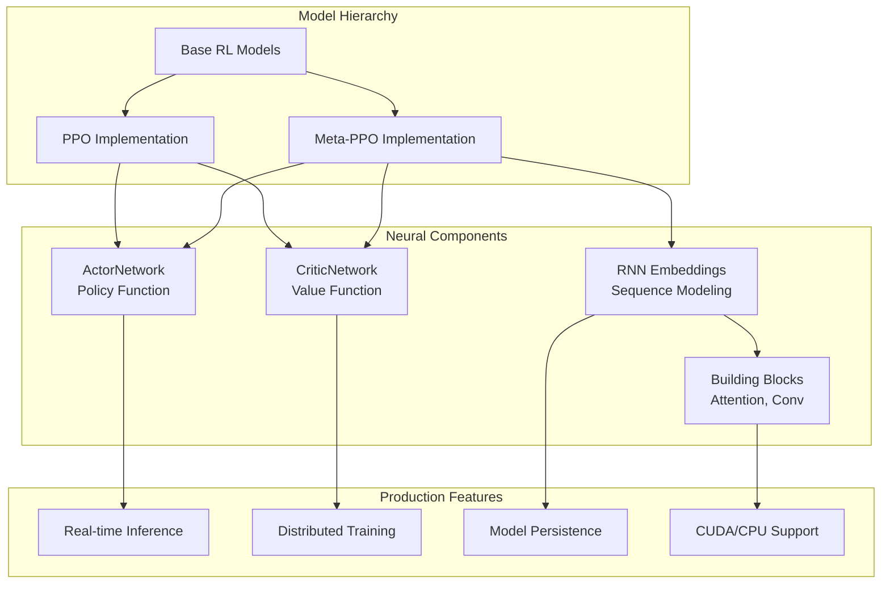
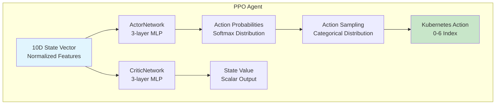
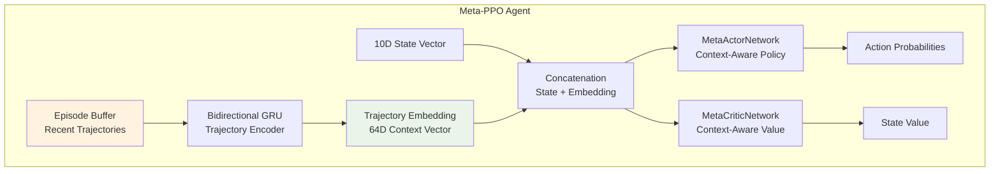

# PyTorch Models Documentation

This document provides a comprehensive deep dive into the PyTorch neural network implementations in the Futura Engine, including PPO, Meta-PPO, and supporting neural architectures.

## 🎯 Overview

The Futura Engine uses **real PyTorch neural networks** for Kubernetes autoscaling decisions, replacing heuristic policies with trained reinforcement learning models.



## 🧠 Core Model Implementations

### PPOAgent - Standard Reinforcement Learning

**Location**: `rl_models/ppo.py`
**Purpose**: Standard PPO implementation for stable, well-understood workloads

#### Architecture Overview



#### Network Architectures

```python
class ActorNetwork(nn.Module):
    """
    PPO Actor Network - Policy network outputting action probabilities.

    Architecture:
    - Input: 10D normalized state vector
    - Hidden: 2 layers of 64 units each with ReLU
    - Output: 7D action probabilities via softmax
    """

    def __init__(self, input_size: int = 10, hidden_size: int = 64, output_size: int = 7):
        super(ActorNetwork, self).__init__()

        self.fc1 = nn.Linear(input_size, hidden_size)    # 10 -> 64
        self.fc2 = nn.Linear(hidden_size, hidden_size)   # 64 -> 64
        self.fc3 = nn.Linear(hidden_size, output_size)   # 64 -> 7
        self.relu = nn.ReLU()
        self.softmax = nn.Softmax(dim=-1)

    def forward(self, input_):
        """Forward pass: state -> action probabilities"""
        if not isinstance(input_, torch.Tensor):
            input_ = torch.FloatTensor(input_)

        output = self.relu(self.fc1(input_))
        output = self.relu(self.fc2(output))
        output = self.fc3(output)

        # For discrete actions (Kubernetes scaling), use softmax
        output = self.softmax(output)
        return output


class CriticNetwork(nn.Module):
    """
    PPO Critic Network - Value function estimating state values.

    Architecture:
    - Input: 10D normalized state vector
    - Hidden: 2 layers of 64 units each with ReLU
    - Output: 1D state value (no activation)
    """

    def __init__(self, input_size: int = 10, hidden_size: int = 64, output_size: int = 1):
        super(CriticNetwork, self).__init__()

        self.fc1 = nn.Linear(input_size, hidden_size)    # 10 -> 64
        self.fc2 = nn.Linear(hidden_size, hidden_size)   # 64 -> 64
        self.fc3 = nn.Linear(hidden_size, output_size)   # 64 -> 1
        self.relu = nn.ReLU()

    def forward(self, input_):
        """Forward pass: state -> value estimate"""
        if not isinstance(input_, torch.Tensor):
            input_ = torch.FloatTensor(input_)

        output = self.relu(self.fc1(input_))
        output = self.relu(self.fc2(output))
        output = self.fc3(output)  # No activation for value output
        return output
```

#### PPO Algorithm Implementation

```python
class PPOAgent:
    """
    Complete PPO implementation with:
    - Clipped surrogate objective
    - Generalized Advantage Estimation (GAE)
    - Entropy regularization
    - Gradient clipping
    """

    def __init__(self, state_size=10, action_size=7, learning_rate=3e-4,
                 gamma=0.99, clip_epsilon=0.2, entropy_coeff=0.01):

        # Initialize networks
        self.actor = ActorNetwork(state_size, 64, action_size)
        self.critic = CriticNetwork(state_size, 64, 1)

        # Shared optimizer for both networks
        self.optimizer = torch.optim.Adam(
            list(self.actor.parameters()) + list(self.critic.parameters()),
            lr=learning_rate
        )

        # PPO hyperparameters from research paper
        self.gamma = gamma              # Discount factor
        self.clip_epsilon = clip_epsilon  # PPO clipping parameter
        self.entropy_coeff = entropy_coeff  # Entropy regularization

    def get_action(self, state, deterministic=False):
        """Get action from policy network."""
        with torch.no_grad():
            state_tensor = torch.FloatTensor(state).unsqueeze(0)
            action_probs = self.actor(state_tensor)

            if deterministic:
                # For inference, select highest probability action
                action = torch.argmax(action_probs, dim=1)
                log_prob = torch.log(action_probs.gather(1, action.unsqueeze(1))).squeeze()
            else:
                # For training, sample from distribution
                dist = torch.distributions.Categorical(action_probs)
                action = dist.sample()
                log_prob = dist.log_prob(action)

            return action.item(), log_prob.item()

    def update(self, states, actions, old_log_probs, rewards, advantages, returns):
        """PPO policy update using clipped surrogate objective."""

        # Convert to tensors
        states_tensor = torch.FloatTensor(states)
        actions_tensor = torch.LongTensor(actions)
        old_log_probs_tensor = torch.FloatTensor(old_log_probs)
        advantages_tensor = torch.FloatTensor(advantages)
        returns_tensor = torch.FloatTensor(returns)

        for epoch in range(5):  # Multiple epochs over same data
            for batch_start in range(0, len(states), 32):  # Mini-batches
                batch_end = min(batch_start + 32, len(states))
                batch_indices = slice(batch_start, batch_end)

                # Current policy predictions
                action_probs = self.actor(states_tensor[batch_indices])
                values = self.critic(states_tensor[batch_indices]).squeeze()

                # New log probabilities and entropy
                dist = torch.distributions.Categorical(action_probs)
                new_log_probs = dist.log_prob(actions_tensor[batch_indices])
                entropy = dist.entropy().mean()

                # PPO clipped objective
                ratios = torch.exp(new_log_probs - old_log_probs_tensor[batch_indices])
                surrogate1 = ratios * advantages_tensor[batch_indices]
                surrogate2 = torch.clamp(ratios, 1-self.clip_epsilon, 1+self.clip_epsilon) * advantages_tensor[batch_indices]

                actor_loss = -torch.min(surrogate1, surrogate2).mean()
                critic_loss = (returns_tensor[batch_indices] - values).pow(2).mean()

                # Total loss with entropy regularization
                loss = actor_loss + 0.05 * critic_loss - self.entropy_coeff * entropy

                # Optimization step
                self.optimizer.zero_grad()
                loss.backward()
                torch.nn.utils.clip_grad_norm_(
                    list(self.actor.parameters()) + list(self.critic.parameters()), 0.5
                )
                self.optimizer.step()
```

### MetaPPOAgent - Meta-Learning for Fast Adaptation

**Location**: `rl_models/meta_ppo.py`
**Purpose**: Fast adaptation to new workloads using trajectory embeddings

#### Meta-Learning Architecture



#### Episode Buffer Management

```python
class MetaPPOAgent:
    """
    Meta-learning PPO with trajectory embeddings for fast adaptation.
    """

    def __init__(self, buffer_size=5, buffer_mode="latest"):
        # Standard PPO components
        self.actor = MetaActorNetwork(...)
        self.critic = MetaCriticNetwork(...)

        # Meta-learning components
        self.episode_buffer = {}
        self.buffer_config = {
            'mode': buffer_mode,      # 'best' or 'latest'
            'buffer_size': buffer_size
        }

    def update_episode_buffer(self, states_ep, actions_ep, rewards_ep):
        """Update episode buffer with new trajectory."""
        reward = np.sum(rewards_ep)

        if self.buffer_config['mode'] == 'best':
            # Keep episodes with highest rewards
            if len(self.episode_buffer) >= self.buffer_config['buffer_size']:
                if reward >= min(self.episode_buffer_rewards):
                    # Remove worst episode
                    worst_reward = heapq.heappop(self.episode_buffer_rewards)
                    del self.episode_buffer[worst_reward]
                else:
                    return  # Don't add poor episode

            heapq.heappush(self.episode_buffer_rewards, reward)
            self.episode_buffer[reward] = {
                'states': states_ep,
                'actions': actions_ep,
                'rewards': rewards_ep
            }

        elif self.buffer_config['mode'] == 'latest':
            # Keep most recent episodes (sliding window)
            if len(self.episode_buffer) >= self.buffer_config['buffer_size']:
                oldest_key = min(self.episode_buffer.keys())
                del self.episode_buffer[oldest_key]

            self.episode_buffer[time.time()] = {
                'states': states_ep,
                'actions': actions_ep,
                'rewards': rewards_ep
            }
```

#### RNN Trajectory Encoding

```python
class MetaActorNetwork(nn.Module):
    """
    Meta-learning actor with RNN trajectory embeddings.
    """

    def __init__(self, input_size, hidden_size, output_size, env_dim, agent):
        super(MetaActorNetwork, self).__init__()

        self.agent = agent  # Reference to MetaPPOAgent for buffer access

        # RNN for trajectory encoding
        self.rnn = RNNEmbedding(
            N=1, K=5, task='wa',
            num_channels=100,  # Max timesteps per episode
            embedding_dim=64
        )

        # Policy network with embedding input
        self.fc1 = nn.Linear(input_size + 64, hidden_size)  # State + embedding
        self.fc2 = nn.Linear(hidden_size, hidden_size)
        self.fc3 = nn.Linear(hidden_size, output_size)
        self.relu = nn.ReLU()
        self.softmax = nn.Softmax(dim=-1)

    def forward(self, input_):
        """Forward pass with trajectory context."""
        # Get trajectory embedding from episode buffer
        padded_states, padded_actions, padded_rewards = get_padded_trajectories(
            self.agent.episode_buffer,
            state_dim=10, action_dim=1
        )

        # Encode trajectories with RNN
        rnn_input = torch.cat((padded_states, padded_actions, padded_rewards), dim=-2)
        hidden = self.rnn.init_hidden(num_sequences=rnn_input.shape[0])
        rnn_output, hidden_state = self.rnn.gru(rnn_input, hidden)

        # Generate trajectory embedding
        embedding = self.rnn.embedding_layer(hidden_state.view(1, -1))
        embedding = self.rnn.relu(embedding)

        # Concatenate state with trajectory embedding
        if not isinstance(input_, torch.Tensor):
            input_ = torch.FloatTensor(input_)

        combined_input = torch.cat((input_, embedding), dim=-1)

        # Forward through policy network
        output = self.relu(self.fc1(combined_input))
        output = self.relu(self.fc2(output))
        output = self.fc3(output)
        output = self.softmax(output)

        return output
```

## 🏗️ Neural Network Building Blocks

### RNN Components (`rl_models/rnn.py`)

#### Bidirectional GRU for Sequence Modeling

```python
class RNNEmbedding(nn.Module):
    """
    RNN-based embedding for trajectory encoding.
    """

    def __init__(self, num_channels, embedding_dim=64, hidden_size=128, num_layers=2):
        super(RNNEmbedding, self).__init__()

        # Bidirectional GRU configuration
        self.hidden_size = hidden_size
        self.num_layers = num_layers
        self.bidirectional = True
        self.directions = 2

        # GRU for sequence encoding
        self.gru = nn.GRU(
            num_channels, hidden_size,
            num_layers=num_layers,
            batch_first=True,
            bidirectional=True
        )

        # Embedding generation layer
        self.embedding_layer = nn.Linear(
            hidden_size * num_layers * self.directions,
            embedding_dim
        )
        self.relu = nn.ReLU()
```

#### SNAIL Architecture (Attention + Temporal Convolution)

```python
class SnailEmbedding(nn.Module):
    """
    SNAIL (Simple Neural Attentive meta-Learner) embedding.
    Combines attention and temporal convolution for meta-learning.
    """

    def __init__(self, N, K, num_features_per_shot=10):
        super(SnailEmbedding, self).__init__()

        num_channels = num_features_per_shot
        num_filters = int(math.ceil(math.log(N * K + 1, 2)))

        # Alternating attention and temporal convolution blocks
        self.attention1 = AttentionBlock(num_channels, 64, 32)
        num_channels += 32

        self.tc1 = TCBlock(num_channels, N * K + 1, 128)
        num_channels += num_filters * 128

        self.attention2 = AttentionBlock(num_channels, 256, 128)
        num_channels += 128

        self.tc2 = TCBlock(num_channels, N * K + 1, 128)
        num_channels += num_filters * 128

        self.attention3 = AttentionBlock(num_channels, 512, 256)
        num_channels += 256

        # Final fully connected layers
        self.fc1 = nn.Linear(num_channels * K + num_features_per_shot * K + 3, 256)
        self.fc2 = nn.Linear(256, 64)
        self.fc3 = nn.Linear(64, N)
```

### Attention Mechanisms (`rl_models/blocks.py`)

#### Causal Attention Block

```python
class AttentionBlock(nn.Module):
    """
    Multi-head attention with causal masking for autoregressive modeling.
    """

    def __init__(self, in_channels, key_size, value_size):
        super(AttentionBlock, self).__init__()

        self.linear_query = nn.Linear(in_channels, key_size)
        self.linear_keys = nn.Linear(in_channels, key_size)
        self.linear_values = nn.Linear(in_channels, value_size)
        self.sqrt_key_size = math.sqrt(key_size)

    def forward(self, input_tensor):
        """Forward pass with causal attention."""
        batch_size, seq_length, _ = input_tensor.shape

        # Create causal mask (upper triangular)
        mask = np.triu(np.ones((seq_length, seq_length)), k=1).astype(bool)
        mask = torch.BoolTensor(mask)

        # Compute queries, keys, values
        queries = self.linear_query(input_tensor)
        keys = self.linear_keys(input_tensor)
        values = self.linear_values(input_tensor)

        # Scaled dot-product attention
        scores = torch.bmm(queries, torch.transpose(keys, 1, 2))
        scores = scores / self.sqrt_key_size

        # Apply causal mask
        scores.data.masked_fill_(mask, -float('inf'))

        # Attention weights and output
        attention_weights = F.softmax(scores, dim=-1)
        attended_values = torch.bmm(attention_weights, values)

        # Residual connection
        return torch.cat((input_tensor, attended_values), dim=2)
```

#### Temporal Convolution Block

```python
class TCBlock(nn.Module):
    """
    Temporal Convolution Block for sequence modeling.
    Uses dilated causal convolutions to capture long-range dependencies.
    """

    def __init__(self, in_channels, seq_length, filters):
        super(TCBlock, self).__init__()

        # Calculate number of dilation layers needed
        num_blocks = int(math.ceil(math.log(seq_length, 2)))

        self.dense_blocks = nn.ModuleList([
            DenseBlock(
                in_channels + i * filters,
                2 ** (i + 1),  # Exponentially increasing dilation
                filters
            )
            for i in range(num_blocks)
        ])

    def forward(self, input_tensor):
        """Forward pass through temporal convolution."""
        # Transpose for convolution: (N, T, C) -> (N, C, T)
        x = torch.transpose(input_tensor, 1, 2)

        # Apply dense blocks sequentially
        for block in self.dense_blocks:
            x = block(x)

        # Transpose back: (N, C, T) -> (N, T, C)
        return torch.transpose(x, 1, 2)


class DenseBlock(nn.Module):
    """Dense block with gated activation (WaveNet-style)."""

    def __init__(self, in_channels, dilation, filters, kernel_size=2):
        super(DenseBlock, self).__init__()

        self.causal_conv1 = CausalConv1d(in_channels, filters, kernel_size, dilation=dilation)
        self.causal_conv2 = CausalConv1d(in_channels, filters, kernel_size, dilation=dilation)

    def forward(self, input_tensor):
        """Gated activation: tanh(W * x) * sigmoid(V * x)"""
        xf = self.causal_conv1(input_tensor)
        xg = self.causal_conv2(input_tensor)
        activations = torch.tanh(xf) * torch.sigmoid(xg)

        # Residual connection by concatenation
        return torch.cat((input_tensor, activations), dim=1)
```

## 🎯 State and Action Spaces

### State Space Processing

**Location**: `rl_models/state_action_space.py`

```python
class StateSpace:
    """
    10-dimensional normalized state space for Kubernetes environments.
    """

    def extract_features(self, raw_metrics: Dict[str, float]) -> np.ndarray:
        """Convert raw metrics to normalized 10D feature vector."""

        # Core resource utilization (0-1 normalized)
        cpu_util = np.clip(raw_metrics.get('cpu_utilization', 0.0), 0, 1)
        memory_util = np.clip(raw_metrics.get('memory_utilization', 0.0), 0, 1)

        # Network and I/O utilization (0-1 normalized)
        network_util = np.clip(raw_metrics.get('network_utilization', 0.0), 0, 1)
        disk_util = np.clip(raw_metrics.get('disk_utilization', 0.0), 0, 1)

        # Application performance metrics (normalized)
        latency_norm = self._normalize_latency(raw_metrics.get('p95_latency_ms', 100))
        request_rate_norm = self._normalize_rate(raw_metrics.get('request_rate', 100))
        processing_rate_norm = self._normalize_rate(raw_metrics.get('processing_rate', 100))

        # Resource allocation context (normalized)
        replica_norm = self._normalize_replicas(raw_metrics.get('num_replicas', 1))
        cpu_limit_norm = self._normalize_cpu_limit(raw_metrics.get('cpu_limit', 1000))
        memory_limit_norm = self._normalize_memory_limit(raw_metrics.get('memory_limit', 512))

        return np.array([
            cpu_util,           # 0: CPU utilization (0-1)
            memory_util,        # 1: Memory utilization (0-1)
            network_util,       # 2: Network utilization (0-1)
            disk_util,          # 3: Disk utilization (0-1)
            latency_norm,       # 4: P95 latency (normalized)
            request_rate_norm,  # 5: Request rate (normalized)
            processing_rate_norm, # 6: Processing rate (normalized)
            replica_norm,       # 7: Replica count (normalized)
            cpu_limit_norm,     # 8: CPU limit (normalized)
            memory_limit_norm   # 9: Memory limit (normalized)
        ], dtype=np.float32)
```

### Action Space Definition

```python
class ActionType(Enum):
    """7 discrete actions for Kubernetes scaling."""
    NO_ACTION = 0           # Do nothing
    HORIZONTAL_UP = 1       # Scale out (+1 replica)
    HORIZONTAL_DOWN = 2     # Scale in (-1 replica)
    VERTICAL_CPU_UP = 3     # Increase CPU (+256m)
    VERTICAL_CPU_DOWN = 4   # Decrease CPU (-256m)
    VERTICAL_MEMORY_UP = 5  # Increase memory (+256Mi)
    VERTICAL_MEMORY_DOWN = 6 # Decrease memory (-256Mi)


class ActionSpace:
    """Action space for Kubernetes scaling operations."""

    def convert_action_to_k8s_changes(self, action_index: int, current_state: Dict) -> Dict:
        """Convert neural network action to Kubernetes resource changes."""
        action_type = ActionType(action_index)

        changes = {
            'vertical_cpu': 0,
            'vertical_memory': 0,
            'horizontal': 0
        }

        if action_type == ActionType.HORIZONTAL_UP:
            changes['horizontal'] = 1
        elif action_type == ActionType.HORIZONTAL_DOWN:
            changes['horizontal'] = -1
        elif action_type == ActionType.VERTICAL_CPU_UP:
            changes['vertical_cpu'] = 256  # milliCPU
        elif action_type == ActionType.VERTICAL_CPU_DOWN:
            changes['vertical_cpu'] = -256
        elif action_type == ActionType.VERTICAL_MEMORY_UP:
            changes['vertical_memory'] = 256  # MiB
        elif action_type == ActionType.VERTICAL_MEMORY_DOWN:
            changes['vertical_memory'] = -256

        return changes
```

## 🔧 Model Lifecycle Management

### Model Checkpointing

```python
class PPOAgent:
    def save_model(self, filepath: str):
        """Save complete model state for production deployment."""
        torch.save({
            'actor_state_dict': self.actor.state_dict(),
            'critic_state_dict': self.critic.state_dict(),
            'optimizer_state_dict': self.optimizer.state_dict(),
            'config': {
                'state_size': self.state_size,
                'action_size': self.action_size,
                'gamma': self.gamma,
                'clip_epsilon': self.clip_epsilon,
                'entropy_coeff': self.entropy_coeff,
                'critic_coeff': self.critic_coeff
            }
        }, filepath)

    def load_model(self, filepath: str):
        """Load model for inference or continued training."""
        checkpoint = torch.load(filepath, map_location=self.device)

        self.actor.load_state_dict(checkpoint['actor_state_dict'])
        self.critic.load_state_dict(checkpoint['critic_state_dict'])
        self.optimizer.load_state_dict(checkpoint['optimizer_state_dict'])

        # Validate configuration matches
        config = checkpoint['config']
        assert config['state_size'] == self.state_size
        assert config['action_size'] == self.action_size
```

### Device Management

```python
def _load_pytorch_model(self, app_key: str, model_meta):
    """Load PyTorch model with automatic device detection."""

    # Automatic CUDA/CPU selection
    device = "cuda" if torch.cuda.is_available() else "cpu"

    if "meta" in model_meta.policy_name.lower():
        # Meta-learning model
        agent = MetaPPOAgent(
            state_size=10, action_size=7,
            device=device, verbose=False
        )
    else:
        # Standard PPO model
        agent = PPOAgent(
            state_size=10, action_size=7,
            device=device
        )

    # Load checkpoint if available
    if os.path.exists(model_meta.checkpoint_uri):
        agent.load_model(model_meta.checkpoint_uri)

    # Set to inference mode (important for production)
    agent.set_training_mode(False)

    return agent
```

## 📊 Model Performance & Monitoring

### Inference Performance

```python
def benchmark_inference_performance():
    """Benchmark neural network inference speed."""

    # Create test models
    ppo_agent = PPOAgent(device="cuda" if torch.cuda.is_available() else "cpu")
    meta_agent = MetaPPOAgent(device="cuda" if torch.cuda.is_available() else "cpu")

    # Test state
    test_state = np.random.rand(10).astype(np.float32)

    # Benchmark PPO inference
    start_time = time.time()
    for _ in range(1000):
        action, log_prob = ppo_agent.get_action(test_state, deterministic=True)
    ppo_time = (time.time() - start_time) / 1000

    # Benchmark Meta-PPO inference
    start_time = time.time()
    for _ in range(1000):
        action, log_prob = meta_agent.get_action(test_state, deterministic=True)
    meta_time = (time.time() - start_time) / 1000

    print(f"PPO inference: {ppo_time*1000:.2f}ms per action")
    print(f"Meta-PPO inference: {meta_time*1000:.2f}ms per action")
```

### Model Validation

```python
def validate_model_performance(agent, test_episodes=100):
    """Validate model performance on test scenarios."""

    total_reward = 0
    action_distribution = Counter()
    confidence_scores = []

    for episode in range(test_episodes):
        # Generate random test state
        test_state = np.random.rand(10).astype(np.float32)

        # Get action and confidence
        action, log_prob = agent.get_action(test_state, deterministic=True)
        confidence = np.exp(log_prob)

        # Track metrics
        action_distribution[action] += 1
        confidence_scores.append(confidence)

        # Simulate reward (replace with actual environment)
        reward = simulate_reward(test_state, action)
        total_reward += reward

    # Performance metrics
    avg_reward = total_reward / test_episodes
    avg_confidence = np.mean(confidence_scores)
    action_entropy = -sum(p * np.log(p) for p in
                         np.array(list(action_distribution.values())) / test_episodes)

    return {
        'avg_reward': avg_reward,
        'avg_confidence': avg_confidence,
        'action_entropy': action_entropy,
        'action_distribution': dict(action_distribution)
    }
```

## 🚀 Development & Testing

### Unit Testing Neural Networks

```python
import pytest
import torch
from rl_models.ppo import PPOAgent, ActorNetwork, CriticNetwork

class TestPPOModels:
    def test_actor_network_output_shape(self):
        """Test ActorNetwork produces correct output shape."""
        actor = ActorNetwork(input_size=10, hidden_size=64, output_size=7)
        test_input = torch.randn(1, 10)

        output = actor(test_input)

        assert output.shape == (1, 7)
        assert torch.allclose(output.sum(dim=1), torch.ones(1))  # Softmax sums to 1

    def test_critic_network_output_shape(self):
        """Test CriticNetwork produces scalar output."""
        critic = CriticNetwork(input_size=10, hidden_size=64, output_size=1)
        test_input = torch.randn(1, 10)

        output = critic(test_input)

        assert output.shape == (1, 1)

    def test_ppo_agent_action_generation(self):
        """Test PPOAgent generates valid actions."""
        agent = PPOAgent(state_size=10, action_size=7)
        test_state = np.random.rand(10)

        action, log_prob = agent.get_action(test_state, deterministic=True)

        assert isinstance(action, int)
        assert 0 <= action < 7
        assert isinstance(log_prob, float)

    def test_model_save_load(self):
        """Test model checkpointing."""
        agent1 = PPOAgent()
        test_state = np.random.rand(10)

        # Get action before saving
        action1, _ = agent1.get_action(test_state, deterministic=True)

        # Save and load model
        agent1.save_model("/tmp/test_model.pth")

        agent2 = PPOAgent()
        agent2.load_model("/tmp/test_model.pth")

        # Should produce same action
        action2, _ = agent2.get_action(test_state, deterministic=True)

        assert action1 == action2
```

### Integration Testing

```python
def test_end_to_end_inference():
    """Test complete inference pipeline."""
    from services.rl_server import RLServer

    # Create RL server
    rl_server = RLServer()

    # Bootstrap model for test app
    app_key = "test/app"
    rl_server._bootstrap_pytorch_model(app_key)

    # Test inference
    features = np.array([0.8, 0.6, 0.1, 0.2, 0.5, 0.7, 0.9, 0.3, 0.4, 0.5])
    current_state = {
        'cpu_util': 0.8,
        'memory_util': 0.6,
        'latency': 200.0
    }

    action_index, confidence = rl_server._run_pytorch_inference(
        app_key, features, current_state
    )

    assert isinstance(action_index, int)
    assert 0 <= action_index < 7
    assert isinstance(confidence, float)
    assert 0.0 <= confidence <= 1.0
```

## 🔗 Related Documentation

- **[RLServer](./rl-server.md)**: Model serving and lifecycle management
- **[Training Pipeline](./training-pipeline.md)**: How these models are trained
- **[State Action Space](./state-action-space.md)**: Feature engineering details
- **[Reward Functions](./reward-functions.md)**: Training objectives
