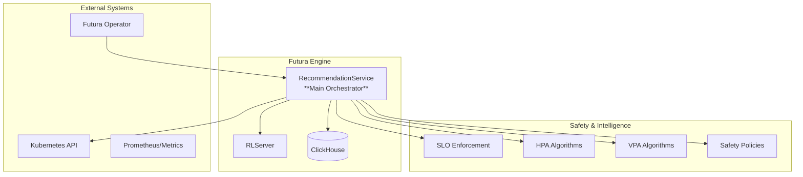
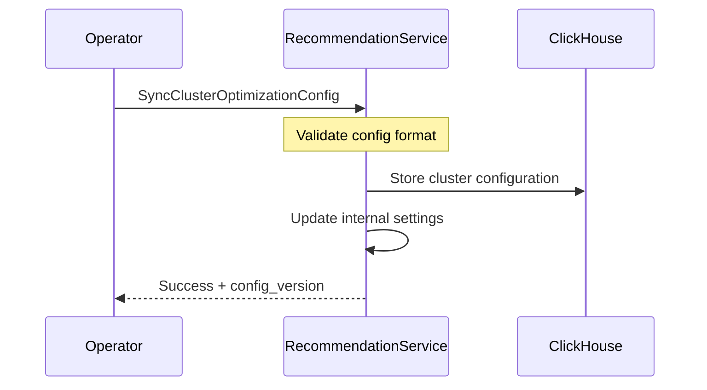
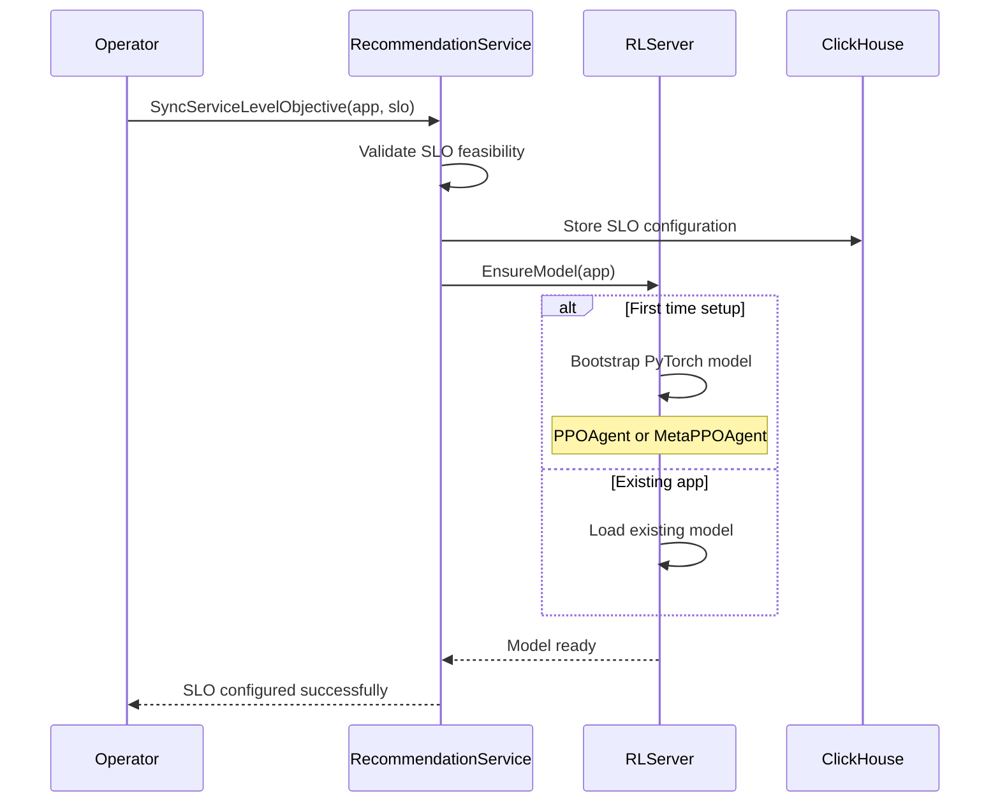
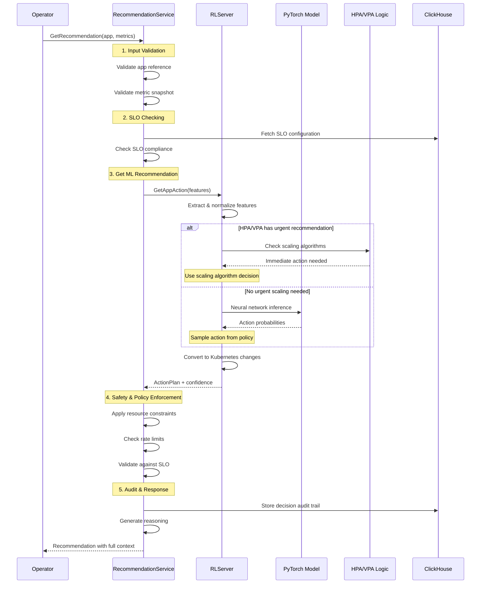
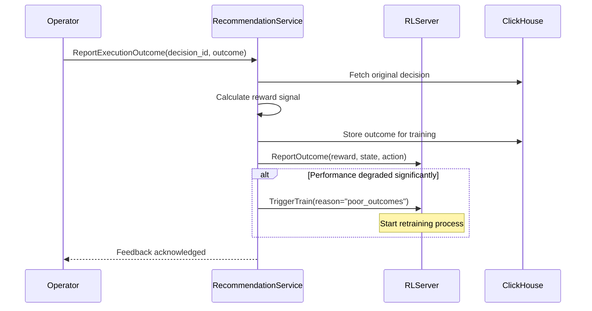
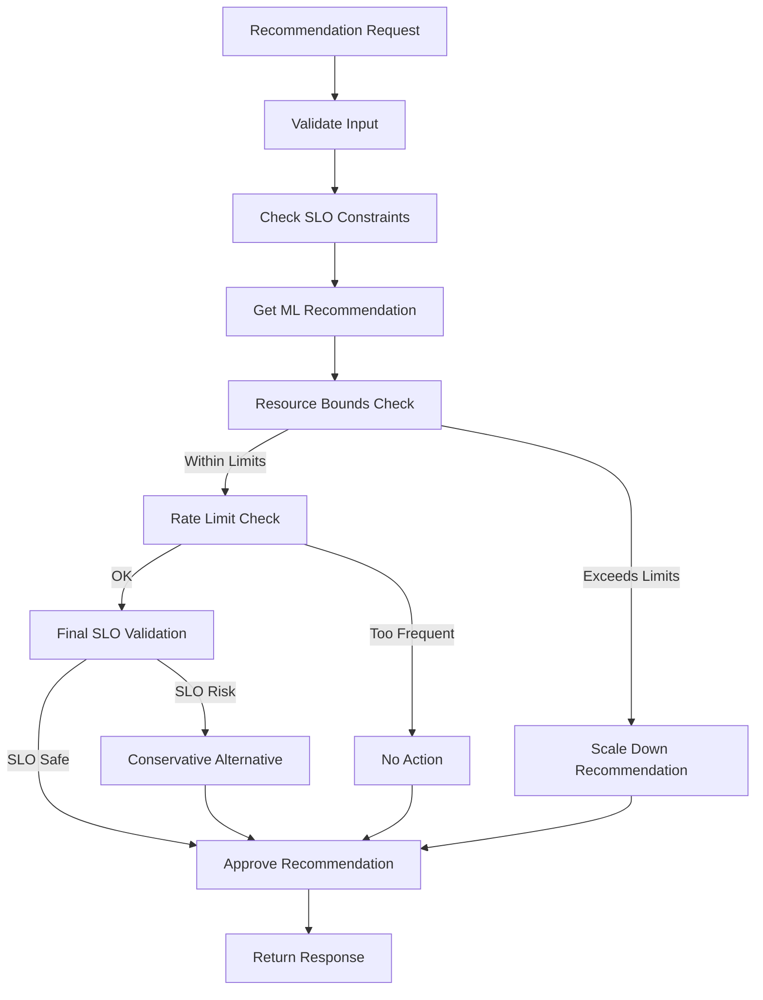
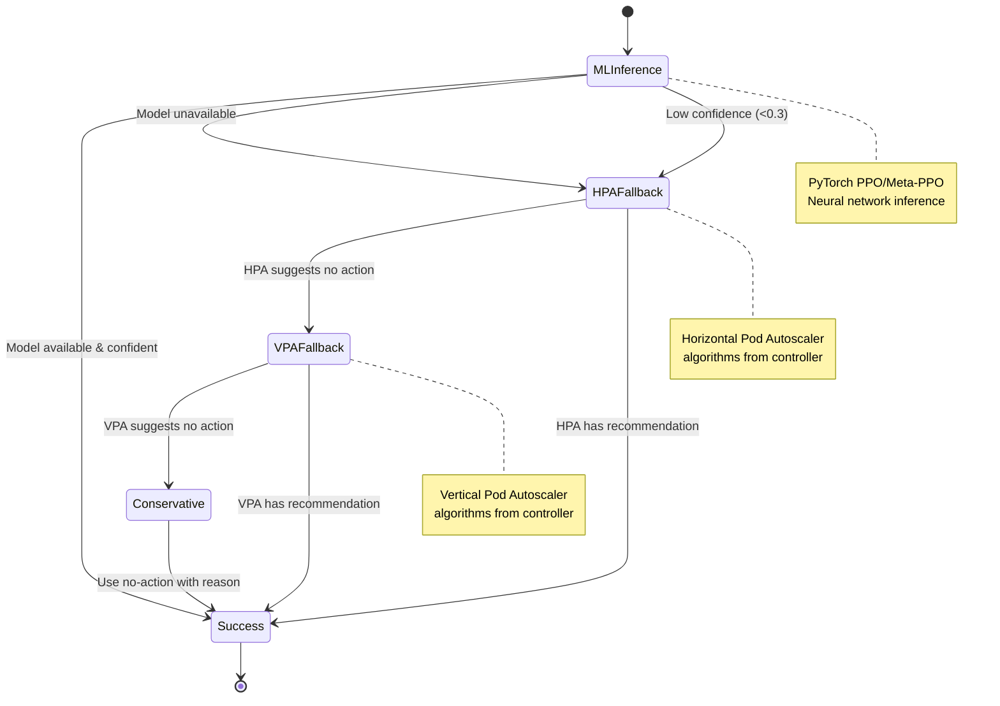
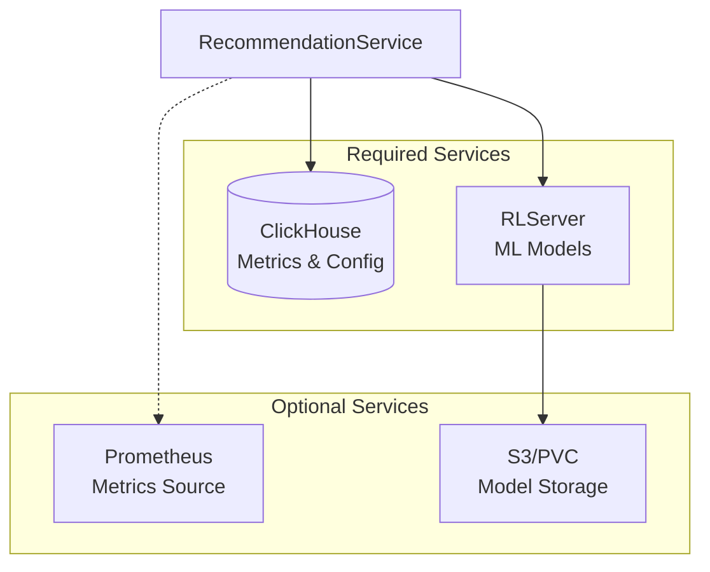
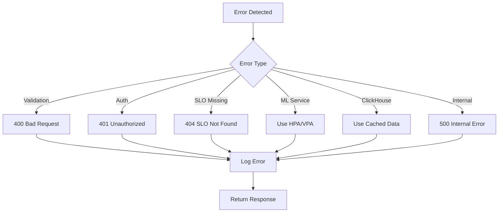

# RecommendationService Documentation

The RecommendationService is the **main API entry point** for the Futura Engine. It orchestrates optimization decisions, enforces safety policies, and provides the primary interface for the Kubernetes operator.

## 🎯 Service Overview

**Primary Role**: MPA (Multi-dimensional Performance Autoscaler) Server
**Port**: 50051 (default)
**Protocol**: gRPC
**Location**: `services/recommendation_service.py`

## 🏗️ Architecture Role



## 📋 Service Interface

### gRPC Methods

#### 1. `SyncClusterOptimizationConfig`

**Purpose**: Configure cluster-wide optimization settings

```protobuf
rpc SyncClusterOptimizationConfig(SyncClusterOptimizationConfigRequest)
    returns (SyncClusterOptimizationConfigResponse);
```

**Request Parameters**:

- `api_key`: Cluster identifier
- `config.cloud_provider`: AWS, GCP, Azure
- `config.budget_constraints`: Cost limits
- `config.instance_types`: Available VM types
- `config.regions`: Geographic constraints

**Response**:

- `success`: Configuration status
- `config_version`: Version for tracking changes

**Flow**:



#### 2. `SyncServiceLevelObjective`

**Purpose**: Define performance targets for applications

```protobuf
rpc SyncServiceLevelObjective(SyncServiceLevelObjectiveRequest)
    returns (SyncServiceLevelObjectiveResponse);
```

**Request Parameters**:

- `app`: Application reference (namespace, name, kind)
- `slo.p95_latency_ms`: Latency target (e.g., 200ms)
- `slo.error_rate_percent`: Error rate limit (e.g., 1%)
- `slo.throughput_rps`: Minimum throughput (e.g., 1000 RPS)

**Response**:

- `success`: SLO acceptance status
- `validation_errors`: Issues with SLO definition

**Flow**:



#### 3. `GetRecommendation`

**Purpose**: Get optimization recommendations for workloads

```protobuf
rpc GetRecommendation(RecommendationRequest) returns (RecommendationResponse);
```

**Request Parameters**:

- `app`: Application reference
- `snapshot`: Current metrics (CPU, memory, latency, etc.)
- `candidates`: Optional pre-computed scaling options
- `deadline`: Response time limit

**Response**:

- `decision_id`: Unique identifier for tracking
- `plan`: Scaling action plan (vertical/horizontal)
- `confidence`: Model confidence score (0.0-1.0)
- `reasoning`: Human-readable explanation
- `model_version`: PyTorch model used

**Detailed Flow**:



#### 4. `ReportExecutionOutcome`

**Purpose**: Receive feedback on recommendation execution

```protobuf
rpc ReportExecutionOutcome(ExecutionOutcomeRequest)
    returns (ExecutionOutcomeResponse);
```

**Request Parameters**:

- `decision_id`: Original recommendation ID
- `outcome`: SUCCESS, FAILED, PARTIALLY_APPLIED
- `applied_changes`: What actually happened
- `error_details`: Failure information
- `post_metrics`: Performance after changes

**Response**:

- `acknowledged`: Feedback received
- `trigger_retraining`: Whether to start training

**Flow**:



## 🧠 Internal Logic & Decision Making

### Safety Policy Engine



### Resource Constraint Enforcement

```python
# Example constraint checking logic
def apply_safety_constraints(action_plan, current_state, slo_config):
    constraints = {
        'max_cpu_limit': 4000,      # 4 cores max
        'max_memory_limit': 8192,   # 8Gi max
        'max_replicas': 20,         # 20 pods max
        'min_replicas': 1,          # Always >= 1
        'max_scale_step': 2         # Max 2x scaling
    }

    # Apply hard limits
    if action_plan.vertical_cpu > constraints['max_cpu_limit']:
        action_plan.vertical_cpu = constraints['max_cpu_limit']

    # Check SLO risk
    if would_violate_slo(action_plan, slo_config):
        return create_conservative_plan(current_state)

    return action_plan
```

### Intelligent Fallback Strategy



## 🔧 Configuration & Environment

### Environment Variables

```bash
# Service Configuration
FUTURA_PORT=50051
FUTURA_MAX_WORKERS=50

# Storage Configuration
FUTURA_CLICKHOUSE_DSN=http://localhost:8123/engine

# RL Server Integration
FUTURA_RL_SERVER_ADDRESS=localhost:50051  # For distributed mode

# Safety Configuration
FUTURA_DEFAULT_CPU_REQUEST_MCPU=1000
FUTURA_DEFAULT_MEMORY_REQUEST_MIB=512
FUTURA_MAX_SCALING_FREQUENCY_MINUTES=5

# Feature Flags
FUTURA_ENABLE_ML_INFERENCE=true
FUTURA_ENABLE_SAFETY_POLICIES=true
FUTURA_ENABLE_SLO_ENFORCEMENT=true
```

### Service Dependencies



## 📊 Monitoring & Observability

### Key Metrics

```yaml
# Prometheus metrics exposed
- futura_recommendations_total{app, action_type, confidence_bucket}
- futura_slo_violations_total{app, slo_type}
- futura_safety_policy_triggers_total{policy_type}
- futura_ml_inference_duration_seconds{model_type}
- futura_recommendation_confidence_score{app}
```

### Log Structure

```json
{
  "timestamp": "2025-01-XX...",
  "service": "recommendation",
  "level": "INFO",
  "decision_id": "uuid-123...",
  "app": "default/web-app",
  "action": "vertical_cpu_up",
  "confidence": 0.85,
  "model_version": "v1.2.3",
  "reasoning": [
    "High CPU utilization (85%) detected",
    "PPO model suggests CPU scaling",
    "SLO compliance maintained",
    "Resource constraints satisfied"
  ],
  "execution_time_ms": 12
}
```

### Error Handling



## 🚀 Development & Testing

### Local Development

```bash
# Start with all services
uv run main.py --port 50051

# Start only RecommendationService (distributed mode)
uv run server.py --services recommendation --port 50052 \
  --rl-server-address localhost:50051
```

### Testing Endpoints

```python
import grpc
from proto.gen.engine import engine_pb2_grpc, engine_pb2

# Connect to service
channel = grpc.insecure_channel('localhost:50051')
client = engine_pb2_grpc.RecommendationServiceStub(channel)

# Test SLO sync
slo_request = engine_pb2.SyncServiceLevelObjectiveRequest(
    app=engine_pb2.AppRef(
        api_key="test-cluster",
        namespace="default",
        app_name="test-app",
        kind=engine_pb2.DEPLOYMENT
    ),
    slo=engine_pb2.ServiceLevelObjective(
        p95_latency_ms=200,
        error_rate_percent=1.0,
        throughput_rps=1000
    )
)

response = client.SyncServiceLevelObjective(slo_request)
print(f"SLO configured: {response.success}")

# Test recommendation
rec_request = engine_pb2.RecommendationRequest(
    app=engine_pb2.AppRef(
        api_key="test-cluster",
        namespace="default",
        app_name="test-app",
        kind=engine_pb2.DEPLOYMENT
    ),
    snapshot=engine_pb2.MetricSnapshot(
        values={
            "cpu_utilization": 0.85,
            "memory_utilization": 0.72,
            "p95_latency_ms": 180,
            "request_rate": 1200
        }
    )
)

rec_response = client.GetRecommendation(rec_request)
print(f"Action: {rec_response.plan.type}")
print(f"Confidence: {rec_response.confidence}")
```

## 🔗 Related Documentation

- **[RLServer](./rl-server.md)**: ML model serving backend
- **[Operator Integration](./operator-integration.md)**: How operators call this service
- **[SLO Management](./slo-management.md)**: Deep dive into SLO handling
- **[Overall Architecture](./architecture.md)**: System-wide data flows
