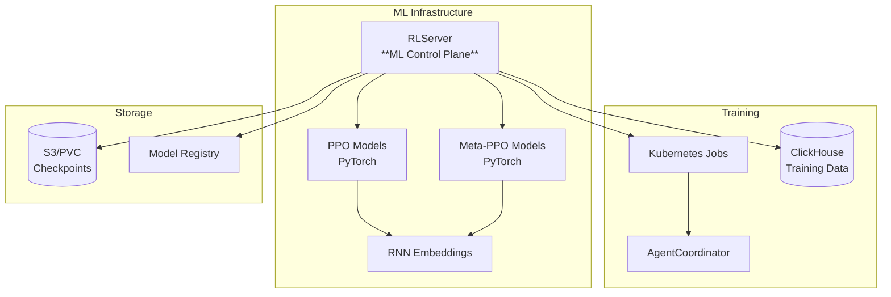
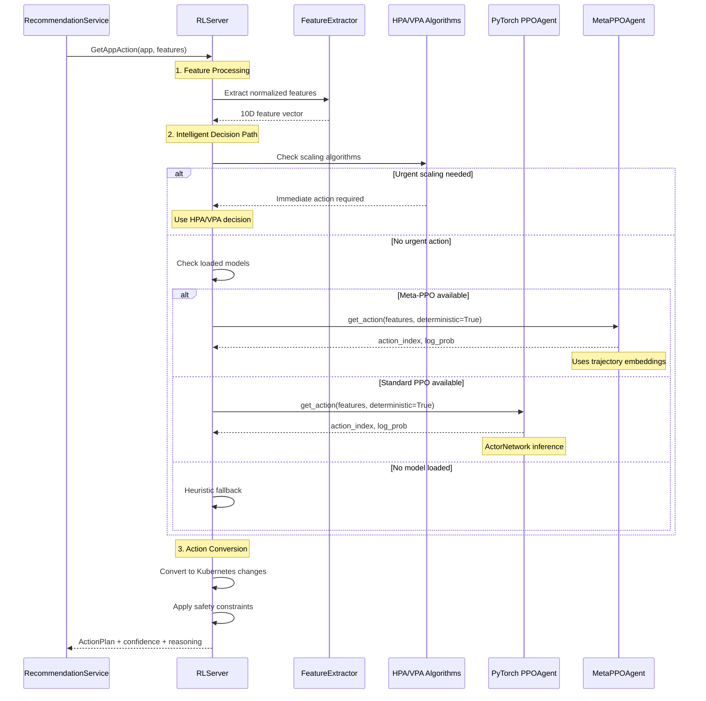
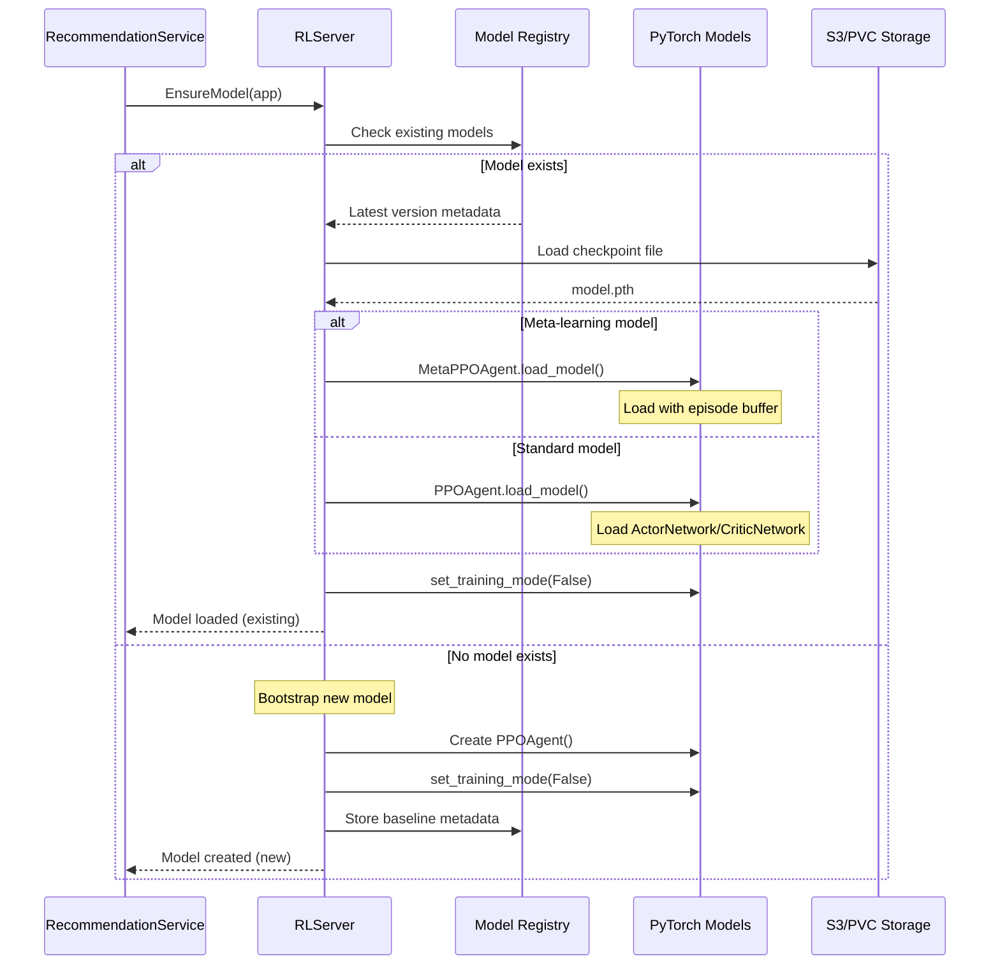
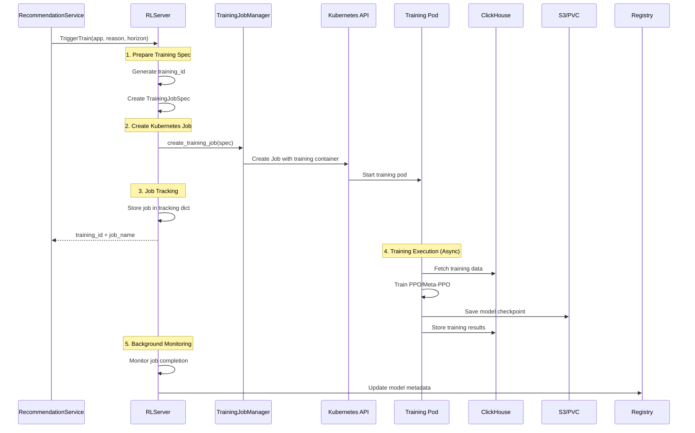
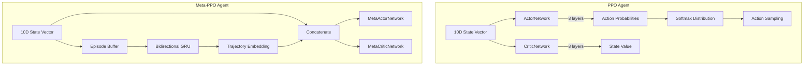
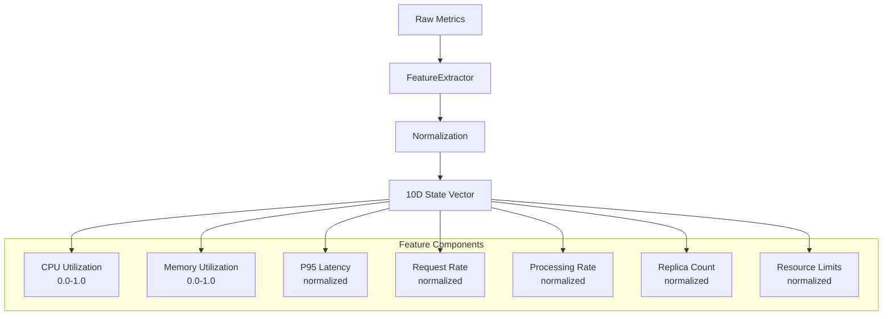
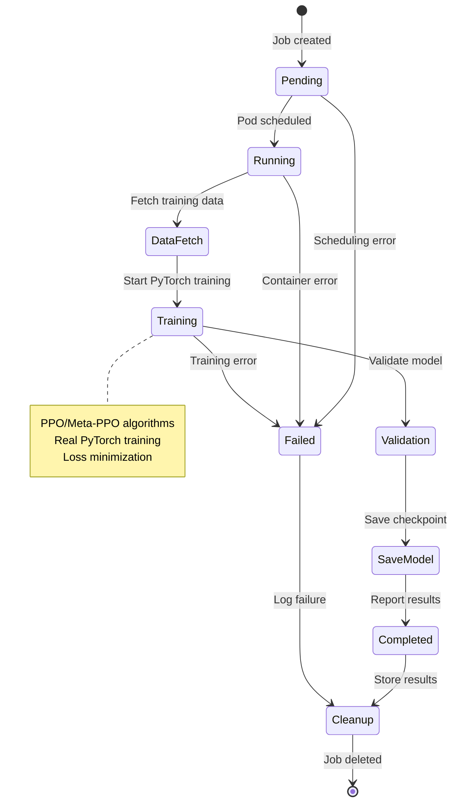

# RLServer Documentation

The RLServer is the **ML brain** of the Futura Engine. It serves PyTorch neural networks for real-time inference, manages model lifecycle, and orchestrates training jobs using Kubernetes.

## 🎯 Service Overview

**Primary Role**: Control Plane for ML Operations
**Port**: 50051 (can be distributed)
**Protocol**: gRPC
**Location**: `services/rl_server.py`

## 🏗️ Architecture Role



## 📋 Service Interface

### gRPC Methods

#### 1. `GetAppAction`

**Purpose**: Real-time neural network inference for scaling decisions

```protobuf
rpc GetAppAction(GetAppActionRequest) returns (GetAppActionResponse);
```

**Request Parameters**:

- `app`: Application reference (namespace, name)
- `features`: Current metrics (CPU, memory, latency, throughput)
- `candidates`: Optional pre-computed scaling options

**Response**:

- `plan`: ActionPlan with scaling changes
- `model_version`: PyTorch model version used
- `confidence`: Neural network confidence (0.0-1.0)
- `decision_id`: Unique identifier for tracking
- `audit_reasons`: Human-readable explanations

**Detailed Inference Flow**:



#### 2. `EnsureModel`

**Purpose**: Bootstrap or load PyTorch models into memory

```protobuf
rpc EnsureModel(AppRef) returns (EnsureModelResponse);
```

**Request Parameters**:

- `api_key`: Cluster identifier
- `namespace`: Kubernetes namespace
- `app_name`: Application name
- `kind`: Resource type (Deployment, StatefulSet)

**Response**:

- `model_version`: Loaded model version
- `created`: Whether a new model was bootstrapped
- `meta`: Model metadata (policy type, training metrics)

**Model Loading Flow**:



#### 3. `TriggerTrain`

**Purpose**: Start Kubernetes Jobs for model training

```protobuf
rpc TriggerTrain(TrainRequest) returns (TrainResponse);
```

**Request Parameters**:

- `app`: Application to train for
- `reason`: Training trigger (drift, poor_performance, scheduled)
- `horizon_hours`: Training data time window
- `base_version`: Existing model to fine-tune (optional)
- `hparams`: Training hyperparameters

**Response**:

- `training_id`: Unique training job identifier
- `job_name`: Kubernetes Job name

**Training Orchestration Flow**:



#### 4. `ListModels` & `GetModelMetadata`

**Purpose**: Model registry management

```protobuf
rpc ListModels(ListModelsRequest) returns (ListModelsResponse);
rpc GetModelMetadata(GetModelMetadataRequest) returns (GetModelMetadataResponse);
```

**ListModels Response**:

- `models[]`: Array of ModelMetadata
- `total_count`: Number of models

**ModelMetadata**:

- `version`: Model version (e.g., "v1.2.3")
- `policy_name`: "ppo" or "meta-ppo"
- `checkpoint_uri`: S3/PVC path to model file
- `training_metrics`: Loss, reward, episodes
- `is_production`: Whether model is serving traffic
- `created_at` / `updated_at`: Timestamps

#### 5. `ReportOutcome`

**Purpose**: Receive feedback for model learning

```protobuf
rpc ReportOutcome(OutcomeRequest) returns (OutcomeResponse);
```

**Request Parameters**:

- `app`: Application reference
- `decision_id`: Original action decision
- `state`: State when action was taken
- `action`: Action that was executed
- `reward`: Calculated reward signal
- `next_state`: Resulting state after action

**Response**:

- `acknowledged`: Feedback received
- `training_triggered`: Whether retraining started

## 🧠 PyTorch Model Integration

### Model Types & Selection

```mermaid
flowchart TD
    Request[Inference Request] --> Check[Check App Models]

    Check --> Meta{Meta-PPO Available?}
    Meta --> |Yes| MetaInf[MetaPPOAgent Inference]
    Meta --> |No| PPO{PPO Available?}

    PPO --> |Yes| PPOInf[PPOAgent Inference]
    PPO --> |No| Fallback[Heuristic Fallback]

    MetaInf --> Conv[Convert Action to K8s]
    PPOInf --> Conv
    Fallback --> Conv

    Conv --> Response[Return ActionPlan]

    note right of MetaInf
        Uses RNN trajectory embeddings
        Fast adaptation to new workloads
        Episode buffer for context
    end note

    note right of PPOInf
        Standard ActorNetwork inference
        Trained on historical data
        Stable performance
    end note
```

### Neural Network Architecture



### Device Management & Performance

```python
# Example device selection and model optimization
def _load_pytorch_model(self, app_key: str, version: str, model_meta):
    # Automatic device detection
    device = "cuda" if torch.cuda.is_available() else "cpu"

    if "meta" in model_meta.policy_name.lower():
        # Meta-learning model with trajectory embeddings
        meta_agent = MetaPPOAgent(
            state_size=10,
            action_size=7,
            hidden_size=64,
            device=device,
            verbose=False
        )

        # Load checkpoint if available
        if os.path.exists(model_meta.checkpoint_uri):
            meta_agent.load_model(model_meta.checkpoint_uri)

        # Set to inference mode (disables dropout, batch norm training)
        meta_agent.set_training_mode(False)
        self.meta_models[app_key] = meta_agent

    else:
        # Standard PPO model
        ppo_agent = PPOAgent(
            state_size=10,
            action_size=7,
            hidden_size=64,
            device=device
        )

        if os.path.exists(model_meta.checkpoint_uri):
            ppo_agent.load_model(model_meta.checkpoint_uri)

        ppo_agent.set_training_mode(False)
        self.pytorch_models[app_key] = ppo_agent
```

## 🔧 Feature Engineering

### State Space Processing



### Action Space Conversion

```python
# Action space mapping
ACTION_MAPPING = {
    0: "NO_ACTION",           # Do nothing
    1: "HORIZONTAL_UP",       # Scale out (+1 replica)
    2: "HORIZONTAL_DOWN",     # Scale in (-1 replica)
    3: "VERTICAL_CPU_UP",     # Increase CPU (+256m)
    4: "VERTICAL_CPU_DOWN",   # Decrease CPU (-256m)
    5: "VERTICAL_MEMORY_UP",  # Increase memory (+256Mi)
    6: "VERTICAL_MEMORY_DOWN" # Decrease memory (-256Mi)
}

def convert_action_to_k8s_action(action_index: int, current_state: Dict) -> Dict:
    action_type = ActionType(action_index)

    k8s_changes = {
        'vertical_cpu': 0,
        'vertical_memory': 0,
        'horizontal': 0
    }

    if action_type == ActionType.HORIZONTAL_UP:
        k8s_changes['horizontal'] = 1
    elif action_type == ActionType.VERTICAL_CPU_UP:
        k8s_changes['vertical_cpu'] = 256  # milliCPU
    # ... etc

    return k8s_changes
```

## 📊 Training Job Management

### Kubernetes Job Specification

```yaml
# Generated training job example
apiVersion: batch/v1
kind: Job
metadata:
  name: futura-train-web-app-20250101-120000
  namespace: futura-training
spec:
  template:
    spec:
      containers:
        - name: trainer
          image: futura/rl-trainer:latest
          env:
            - name: TRAINING_ID
              value: "uuid-12345"
            - name: APP_KEY
              value: "default/web-app"
            - name: CLICKHOUSE_DSN
              value: "http://clickhouse:8123/engine"
            - name: CHECKPOINT_URI
              value: "s3://futura-models/default-web-app/uuid-12345"
            - name: LEARNING_RATE
              value: "0.001"
            - name: USE_META_LEARNING
              value: "true"
          resources:
            requests:
              cpu: "2"
              memory: "4Gi"
            limits:
              cpu: "4"
              memory: "8Gi"
      restartPolicy: Never
```

### Training Lifecycle Monitoring



## 🔒 Security & Safety

### Model Validation

```python
def validate_model_checkpoint(checkpoint_path: str) -> bool:
    """Validate PyTorch checkpoint before loading."""
    try:
        # Check file integrity
        checkpoint = torch.load(checkpoint_path, map_location='cpu')

        # Validate expected keys
        required_keys = ['actor_state_dict', 'critic_state_dict', 'config']
        if not all(key in checkpoint for key in required_keys):
            return False

        # Validate model architecture matches
        config = checkpoint['config']
        if config['state_size'] != 10 or config['action_size'] != 7:
            return False

        return True
    except Exception:
        return False
```

### Resource Constraints

```python
# Training job resource limits
TRAINING_RESOURCE_LIMITS = {
    'cpu_request': '2',      # 2 CPU cores
    'memory_request': '4Gi', # 4GB memory
    'cpu_limit': '4',        # 4 CPU cores max
    'memory_limit': '8Gi',   # 8GB memory max
    'timeout_hours': 6,      # Max training time
    'gpu_limit': 1           # Optional GPU
}

# Inference performance limits
INFERENCE_LIMITS = {
    'max_response_time_ms': 50,  # 50ms inference SLA
    'batch_size_limit': 1,       # Single request processing
    'model_memory_limit_mb': 512 # 512MB model size limit
}
```

## 📈 Monitoring & Observability

### Model Performance Metrics

```yaml
# Prometheus metrics
- rl_inference_duration_seconds{app, model_type}
- rl_model_confidence_score{app, action_type}
- rl_action_distribution{app, action}
- rl_training_jobs_total{status}
- rl_model_loading_errors_total{app, error_type}
- rl_pytorch_memory_usage_bytes{device}
```

### Logging Structure

```json
{
  "timestamp": "2025-01-XX...",
  "service": "rl_server",
  "level": "INFO",
  "operation": "pytorch_inference",
  "app": "default/web-app",
  "model_type": "meta_ppo",
  "model_version": "v1.2.3",
  "device": "cuda:0",
  "inference_time_ms": 5.2,
  "action_index": 3,
  "action_type": "VERTICAL_CPU_UP",
  "confidence": 0.87,
  "features": [0.85, 0.72, 0.23, ...],
  "decision_id": "uuid-456"
}
```

## 🚀 Development & Testing

### Local Development

```bash
# Start RLServer with other services
uv run main.py

# Start only RLServer (distributed mode)
uv run server.py --services rl --port 50051
```

### Testing Neural Network Inference

```python
import torch
from rl_models.ppo import PPOAgent

# Test PPO model directly
agent = PPOAgent(state_size=10, action_size=7)
agent.set_training_mode(False)

# Simulate normalized features
features = torch.FloatTensor([0.85, 0.72, 0.2, 0.1, 0.8, 0.5, 0.3, 0.6, 0.1, 0.9])

# Get action
action_index, log_prob = agent.get_action(features.numpy(), deterministic=True)
print(f"Action: {action_index}, Confidence: {torch.exp(torch.tensor(log_prob)):.3f}")

# Test via gRPC
import grpc
from proto.gen.engine import engine_pb2_grpc, engine_pb2

channel = grpc.insecure_channel('localhost:50051')
client = engine_pb2_grpc.RLServerStub(channel)

response = client.GetAppAction(
    engine_pb2.GetAppActionRequest(
        app=engine_pb2.AppRef(
            api_key="test",
            namespace="default",
            app_name="test-app"
        ),
        features={
            "cpu_utilization": 0.85,
            "memory_utilization": 0.72,
            "p95_latency_ms": 200,
            "request_rate": 1000
        }
    )
)

print(f"Plan: {response.plan}")
print(f"Confidence: {response.confidence}")
print(f"Model: {response.model_version}")
```

## 🔗 Related Documentation

- **[PyTorch Models](./pytorch-models.md)**: Deep dive into neural network implementations
- **[Training Pipeline](./training-pipeline.md)**: End-to-end training workflow
- **[State Action Space](./state-action-space.md)**: Feature engineering details
- **[AgentCoordinator](./agent-coordinator.md)**: Training job coordination
