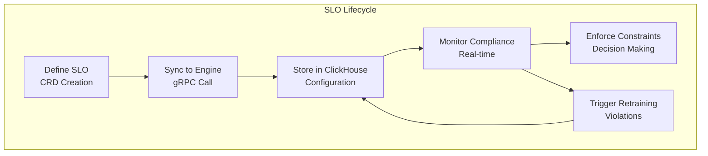
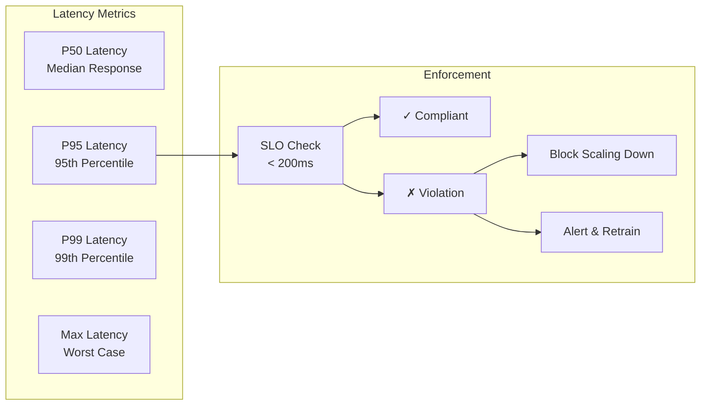
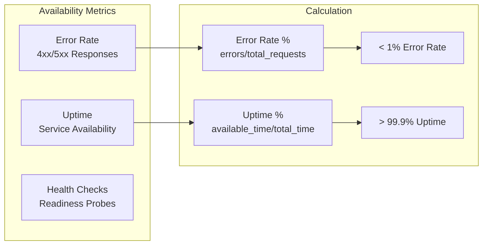
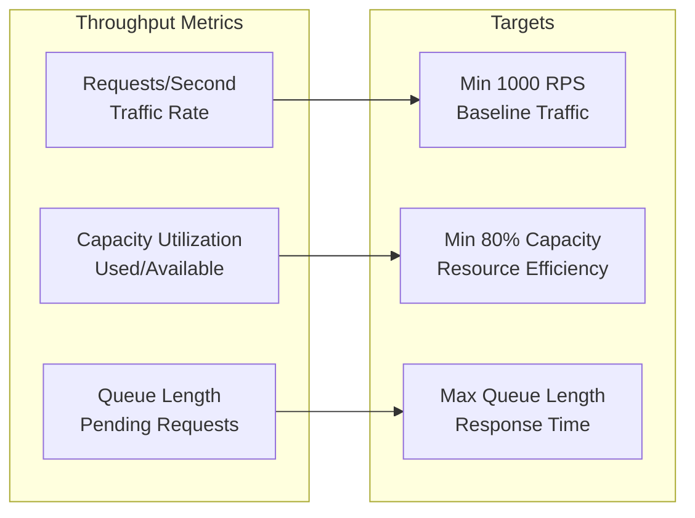
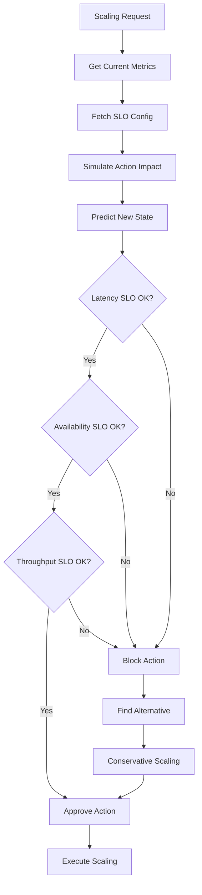
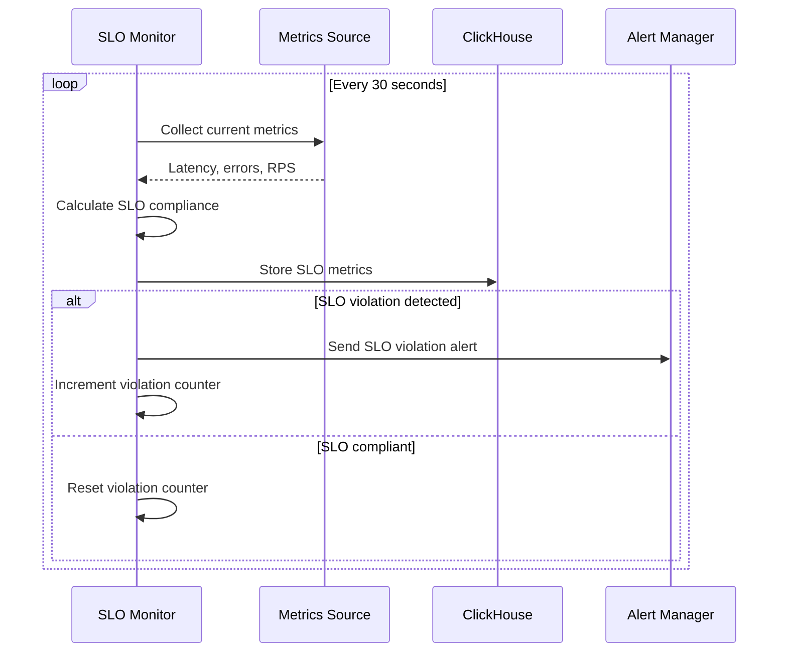
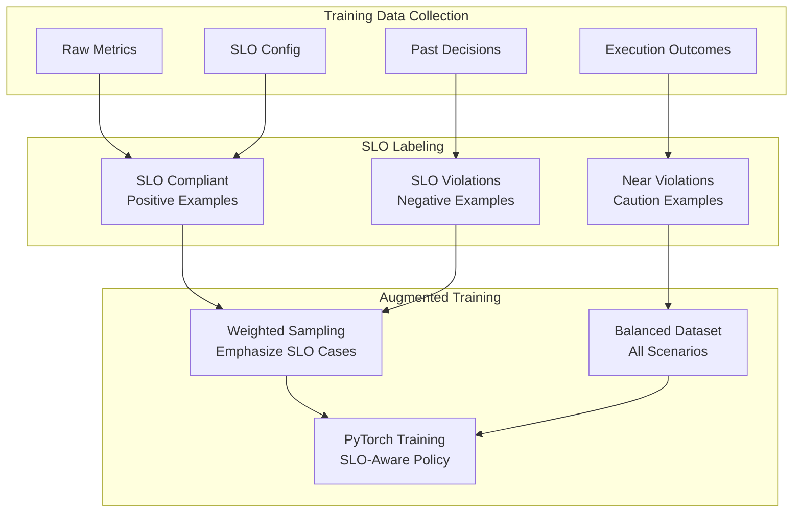

# SLO Management Documentation

This document explains how Service Level Objectives (SLOs) are defined, managed, and enforced in the Futura Engine to ensure optimal performance while maintaining reliability guarantees.

## 🎯 SLO Overview

Service Level Objectives (SLOs) define the **performance targets** that applications must meet. The Futura Engine uses SLOs to:

- **Guide optimization decisions** - ML models prioritize SLO compliance
- **Prevent harmful scaling** - Block actions that risk SLO violations
- **Trigger retraining** - Start model updates when SLOs are violated
- **Measure success** - Track optimization effectiveness



## 📋 SLO Definition Structure

### Core SLO Components

```yaml
apiVersion: futura.io/v1
kind: ServiceLevelObjective
metadata:
  name: web-app-slo
  namespace: production
spec:
  # Target application
  target:
    apiVersion: apps/v1
    kind: Deployment
    name: web-app
    namespace: production

  # Performance objectives
  objectives:
    latency:
      p95_ms: 200 # 95th percentile latency < 200ms
      p99_ms: 500 # 99th percentile latency < 500ms

    availability:
      error_rate_percent: 1.0 # Error rate < 1%
      uptime_percent: 99.9 # Uptime > 99.9%

    throughput:
      requests_per_second: 1000 # Minimum 1000 RPS
      min_capacity_percent: 80 # At least 80% capacity utilization

  # Optimization configuration
  optimization:
    enabled: true
    scaling_policy: balanced # conservative, balanced, aggressive
    ml_model_preference: auto # ppo, meta-ppo, auto

    constraints:
      min_replicas: 2
      max_replicas: 20
      min_cpu_millicores: 500
      max_cpu_millicores: 2000
      min_memory_mb: 512
      max_memory_mb: 4096
```

### SLO Types & Metrics

#### 1. Latency SLOs



**Supported Latency SLOs**:

- `p50_ms`: Median latency target
- `p95_ms`: 95th percentile latency (most common)
- `p99_ms`: 99th percentile latency (strict)
- `max_ms`: Maximum acceptable latency

#### 2. Availability SLOs



**Supported Availability SLOs**:

- `error_rate_percent`: Maximum error rate (e.g., 1.0%)
- `uptime_percent`: Minimum uptime (e.g., 99.9%)
- `success_rate_percent`: Minimum success rate (inverse of error rate)

#### 3. Throughput SLOs



**Supported Throughput SLOs**:

- `requests_per_second`: Minimum RPS to maintain
- `min_capacity_percent`: Minimum resource utilization
- `max_queue_length`: Maximum request queue size

## 🧠 SLO Enforcement Engine

### Decision Flow with SLO Constraints



### SLO Compliance Checking

```python
class SLOEnforcer:
    """
    SLO compliance checking and enforcement.
    """

    def __init__(self, clickhouse_client):
        self.clickhouse_client = clickhouse_client

    async def check_slo_compliance(
        self,
        app_key: str,
        proposed_action: Dict[str, int],
        current_state: Dict[str, float]
    ) -> Tuple[bool, List[str]]:
        """
        Check if proposed action would violate SLOs.

        Returns:
            (is_compliant, violation_reasons)
        """
        # Fetch SLO configuration
        slo_config = await self._get_slo_config(app_key)
        if not slo_config:
            return True, []  # No SLO defined, allow action

        violations = []

        # Predict state after action
        predicted_state = self._predict_state_after_action(
            current_state, proposed_action
        )

        # Check latency SLOs
        if slo_config.get('p95_latency_ms'):
            predicted_latency = self._predict_latency(predicted_state)
            if predicted_latency > slo_config['p95_latency_ms']:
                violations.append(
                    f"Predicted P95 latency {predicted_latency:.1f}ms "
                    f"exceeds SLO {slo_config['p95_latency_ms']}ms"
                )

        # Check availability SLOs
        if slo_config.get('error_rate_percent'):
            predicted_error_rate = self._predict_error_rate(predicted_state)
            if predicted_error_rate > slo_config['error_rate_percent']:
                violations.append(
                    f"Predicted error rate {predicted_error_rate:.2f}% "
                    f"exceeds SLO {slo_config['error_rate_percent']}%"
                )

        # Check throughput SLOs
        if slo_config.get('requests_per_second'):
            predicted_rps = self._predict_throughput(predicted_state)
            if predicted_rps < slo_config['requests_per_second']:
                violations.append(
                    f"Predicted throughput {predicted_rps:.1f} RPS "
                    f"below SLO {slo_config['requests_per_second']} RPS"
                )

        return len(violations) == 0, violations

    def _predict_latency(self, predicted_state: Dict[str, float]) -> float:
        """Predict P95 latency based on resource state."""
        # CPU utilization strongly correlates with latency
        cpu_util = predicted_state.get('cpu_util', 0.5)
        memory_util = predicted_state.get('memory_util', 0.5)

        # Empirical model: latency increases exponentially with utilization
        base_latency = 50  # ms
        cpu_factor = 1 + (cpu_util ** 2) * 3  # Quadratic increase
        memory_factor = 1 + max(0, memory_util - 0.8) * 5  # Sharp increase after 80%

        predicted_latency = base_latency * cpu_factor * memory_factor
        return predicted_latency

    def _predict_error_rate(self, predicted_state: Dict[str, float]) -> float:
        """Predict error rate based on resource state."""
        cpu_util = predicted_state.get('cpu_util', 0.5)
        memory_util = predicted_state.get('memory_util', 0.5)

        # Error rate increases sharply when resources are exhausted
        if cpu_util > 0.95 or memory_util > 0.95:
            return 5.0  # 5% error rate when overloaded

        if cpu_util > 0.85 or memory_util > 0.85:
            return 1.5  # 1.5% error rate when stressed

        return 0.1  # Baseline 0.1% error rate
```

## 📊 SLO Monitoring & Alerting

### Real-time SLO Tracking



### SLO Violation Detection

```python
class SLOMonitor:
    """
    Real-time SLO monitoring and violation detection.
    """

    def __init__(self, clickhouse_client):
        self.clickhouse_client = clickhouse_client
        self.violation_counters = {}  # app_key -> violation count

    async def monitor_slo_compliance(self, app_key: str):
        """Monitor SLO compliance for an application."""

        # Get current metrics
        current_metrics = await self._collect_current_metrics(app_key)
        slo_config = await self._get_slo_config(app_key)

        if not slo_config:
            return

        violations = []

        # Check each SLO type
        violations.extend(self._check_latency_slos(current_metrics, slo_config))
        violations.extend(self._check_availability_slos(current_metrics, slo_config))
        violations.extend(self._check_throughput_slos(current_metrics, slo_config))

        # Store monitoring results
        await self._store_slo_monitoring_result(app_key, violations)

        # Handle violations
        if violations:
            await self._handle_slo_violations(app_key, violations)
        else:
            # Reset violation counter on compliance
            self.violation_counters[app_key] = 0

    def _check_latency_slos(self, metrics: Dict, slo_config: Dict) -> List[str]:
        """Check latency SLO compliance."""
        violations = []

        if 'p95_latency_ms' in slo_config:
            current_p95 = metrics.get('p95_latency_ms', 0)
            target_p95 = slo_config['p95_latency_ms']

            if current_p95 > target_p95:
                violations.append(
                    f"P95 latency {current_p95:.1f}ms exceeds SLO {target_p95}ms"
                )

        if 'p99_latency_ms' in slo_config:
            current_p99 = metrics.get('p99_latency_ms', 0)
            target_p99 = slo_config['p99_latency_ms']

            if current_p99 > target_p99:
                violations.append(
                    f"P99 latency {current_p99:.1f}ms exceeds SLO {target_p99}ms"
                )

        return violations

    async def _handle_slo_violations(self, app_key: str, violations: List[str]):
        """Handle detected SLO violations."""

        # Increment violation counter
        self.violation_counters[app_key] = self.violation_counters.get(app_key, 0) + 1
        violation_count = self.violation_counters[app_key]

        logger.warning(f"SLO violations for {app_key}: {violations}")

        # Trigger retraining after persistent violations
        if violation_count >= 3:  # 3 consecutive violations
            logger.info(f"Triggering retraining for {app_key} due to persistent SLO violations")
            await self._trigger_retraining(app_key, "slo_violations")

        # Send alerts
        await self._send_slo_alert(app_key, violations, violation_count)
```

## 🔧 SLO-Aware ML Training

### Reward Function Integration

```python
class SLOAwareRewardCalculator:
    """
    Reward calculation that prioritizes SLO compliance.
    """

    def calculate_reward_v3_slo_aware(
        self,
        current_state: Dict[str, float],
        action: Dict[str, int],
        next_state: Dict[str, float],
        slo_config: Dict[str, float]
    ) -> float:
        """
        SLO-aware reward function (v3).

        Heavily penalizes SLO violations while rewarding efficiency.
        """

        # Base efficiency reward
        resource_efficiency = self._calculate_resource_efficiency(next_state)
        performance_score = self._calculate_performance_score(next_state)

        base_reward = 0.6 * resource_efficiency + 0.4 * performance_score

        # SLO compliance checking
        slo_penalties = 0.0

        # Heavy penalty for latency SLO violations
        if 'p95_latency_ms' in slo_config:
            current_latency = next_state.get('latency', 100)
            target_latency = slo_config['p95_latency_ms']

            if current_latency > target_latency:
                # Exponential penalty for SLO violations
                violation_ratio = current_latency / target_latency
                slo_penalties += 10.0 * (violation_ratio - 1.0) ** 2

        # Penalty for availability SLO violations
        if 'error_rate_percent' in slo_config:
            current_error_rate = next_state.get('error_rate', 0.1)
            target_error_rate = slo_config['error_rate_percent']

            if current_error_rate > target_error_rate:
                violation_ratio = current_error_rate / target_error_rate
                slo_penalties += 8.0 * (violation_ratio - 1.0) ** 2

        # Penalty for throughput SLO violations
        if 'requests_per_second' in slo_config:
            current_rps = next_state.get('request_rate', 100)
            target_rps = slo_config['requests_per_second']

            if current_rps < target_rps:
                deficit_ratio = 1.0 - (current_rps / target_rps)
                slo_penalties += 6.0 * deficit_ratio ** 2

        # Oscillation penalty (unchanged)
        oscillation_penalty = self._calculate_oscillation_penalty(action)

        # Final reward with SLO constraints
        final_reward = base_reward - slo_penalties - oscillation_penalty

        return final_reward
```

### SLO-Guided Training Data



## 📈 SLO Analytics & Reporting

### SLO Dashboard Metrics

```yaml
# Key SLO metrics for monitoring
slo_metrics:
  compliance:
    - slo_compliance_rate{app, slo_type} # % time in compliance
    - slo_violation_duration_seconds{app} # Time spent violated
    - slo_violation_count_total{app, severity} # Number of violations

  performance:
    - slo_margin_percent{app, slo_type} # How close to violation
    - slo_headroom_seconds{app} # Time until violation
    - slo_recovery_time_seconds{app} # Time to recover

  optimization:
    - slo_aware_decisions_total{app, action} # SLO-influenced decisions
    - slo_prevented_violations_total{app} # Violations prevented
    - slo_optimization_effectiveness{app} # Success rate
```

### SLO Compliance Reports

```python
class SLOReporter:
    """Generate SLO compliance reports."""

    async def generate_weekly_slo_report(self, app_key: str) -> Dict:
        """Generate weekly SLO compliance report."""

        end_time = datetime.utcnow()
        start_time = end_time - timedelta(days=7)

        # Query SLO metrics from ClickHouse
        compliance_data = await self._query_slo_compliance(
            app_key, start_time, end_time
        )

        report = {
            'app_key': app_key,
            'period': {'start': start_time, 'end': end_time},
            'summary': {
                'overall_compliance_rate': compliance_data['overall_rate'],
                'total_violations': compliance_data['violation_count'],
                'worst_violation': compliance_data['worst_violation'],
                'recovery_times': compliance_data['recovery_stats']
            },
            'by_slo_type': {
                'latency': {
                    'compliance_rate': compliance_data['latency_compliance'],
                    'violations': compliance_data['latency_violations'],
                    'avg_value': compliance_data['avg_latency'],
                    'max_value': compliance_data['max_latency']
                },
                'availability': {
                    'compliance_rate': compliance_data['availability_compliance'],
                    'violations': compliance_data['availability_violations'],
                    'avg_error_rate': compliance_data['avg_error_rate'],
                    'max_error_rate': compliance_data['max_error_rate']
                },
                'throughput': {
                    'compliance_rate': compliance_data['throughput_compliance'],
                    'violations': compliance_data['throughput_violations'],
                    'avg_rps': compliance_data['avg_rps'],
                    'min_rps': compliance_data['min_rps']
                }
            },
            'optimization_impact': {
                'prevented_violations': compliance_data['prevented_violations'],
                'ml_decisions': compliance_data['ml_decision_count'],
                'fallback_decisions': compliance_data['fallback_decision_count']
            }
        }

        return report
```

## 🚀 Best Practices

### SLO Definition Guidelines

1. **Start Conservative**: Begin with achievable SLOs and tighten over time
2. **Measure First**: Establish baseline performance before setting SLOs
3. **Account for Dependencies**: Consider upstream/downstream service SLOs
4. **Regular Review**: Update SLOs as application requirements evolve

### SLO Configuration Examples

#### Web Application SLO

```yaml
# Typical web application SLO
objectives:
  latency:
    p95_ms: 200 # User experience target
    p99_ms: 500 # Prevent outliers

  availability:
    error_rate_percent: 1.0 # 99% success rate
    uptime_percent: 99.9 # "Three nines"

  throughput:
    requests_per_second: 1000 # Peak traffic handling
    min_capacity_percent: 70 # Resource efficiency
```

#### API Service SLO

```yaml
# High-performance API service SLO
objectives:
  latency:
    p95_ms: 100 # Strict latency requirement
    p99_ms: 200 # Very low tail latency

  availability:
    error_rate_percent: 0.1 # 99.9% success rate
    uptime_percent: 99.95 # "Four nines"

  throughput:
    requests_per_second: 5000 # High throughput requirement
    min_capacity_percent: 85 # High efficiency
```

#### Batch Processing SLO

```yaml
# Batch processing job SLO
objectives:
  latency:
    p95_ms: 1000 # Less strict latency

  availability:
    error_rate_percent: 5.0 # Some failures acceptable
    uptime_percent: 99.0 # Regular maintenance windows

  throughput:
    requests_per_second: 100 # Lower throughput
    min_capacity_percent: 90 # High resource utilization
```

## 🔗 Related Documentation

- **[Operator Integration](./operator-integration.md)**: How SLOs are synced from CRDs
- **[RecommendationService](./recommendation-service.md)**: SLO enforcement in decisions
- **[Reward Functions](./reward-functions.md)**: SLO integration in ML training
- **[ClickHouse Integration](./clickhouse-integration.md)**: SLO data storage
